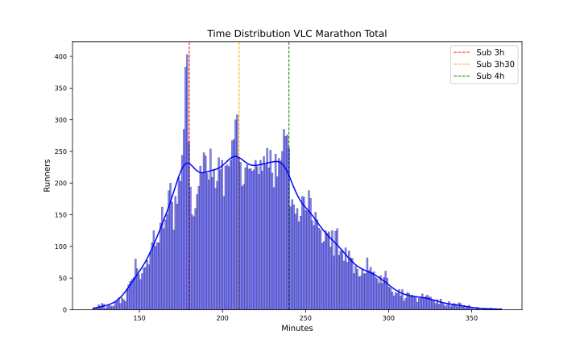
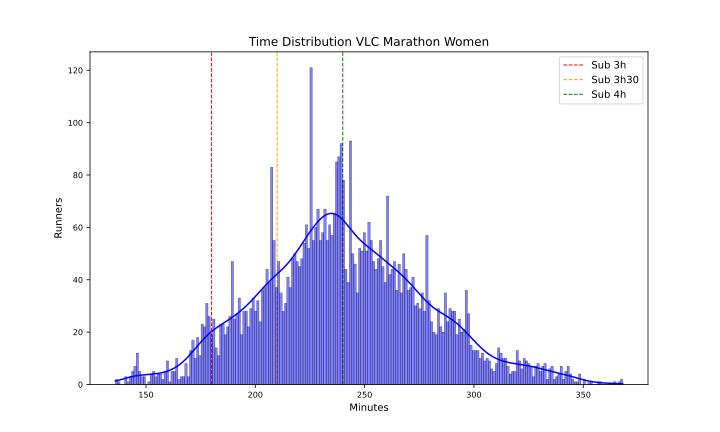

VLC 2023
========

# Datos del maratón de VLC 2023 Fecha: 04/12/23

El maratón de VLC 2023 ha tenido 25900 finishers, de los que 5337 fueron mujeres, lo que supone un 20.61% del total.

El tiempo medio de todos los participantes ha sido 3:38:00, el de los hombres 3:32:12 y el de las mujeres 4:00:12.

El tiempo medio del 10% más rápido ha sido 2:37:24, y el del 25% 2:49:48.El tiempo medio de los 100 primeros ha sido 2:11:36, y para los 1000 primeros 2:27:48.

En esta tabla se resume el número de finishers por espacios de tiempos y el porcentaje respecto al total:  

|Tiempo|Finishers|%|
| :---: | :---: | :---: |
|Sub2:10|40|0.15|
|Sub2:20|132|0.51|
|Sub2:30|566|2.19|
|Sub2:45|1979|7.64|
|Sub3:00|5243|20.24|
|Sub3:30|11877|45.86|
|Sub4:00|18855|72.8|
|Over4:00|7045|27.2|

Por último, en cuanto al resumen general, la primera media maratón tiene un tiempo medio de 1:44:54 y la segunda de 1:53:06 con un 19.27% de Negative Pace. Para los hombres, la primera media maratón tiene un tiempo medio de 1:42:06 y la segunda de 1:50:06 con un 19.44% de Negative Pace. Y para las mujeres, la primera media maratón tiene un tiempo medio de 1:55:48 y la segunda de 2:04:24 con un 18.64% de Negative Pace.

Las siguientes imágenes muestran la distribución de tiempos de los corredores en el maratón por género:  
  
  

## Datos por grupo de edad y género

A continuación se muestran los datos de los corredores por grupos de edad y género:
### Resultados por grupos de edad en hombres
  

| AgeGroup   |     % | Mean    | Min     | Max     |
|:-----------|------:|:--------|:--------|:--------|
| 23-34      | 24.53 | 3:21:42 | 2:01:48 | 5:54:24 |
| 40-44      | 17.93 | 3:28:24 | 2:04:18 | 6:01:12 |
| 45-49      | 17.5  | 3:34:36 | 2:18:12 | 6:03:12 |
| 35-39      | 15.28 | 3:22:30 | 2:05:48 | 5:45:00 |
| 50-54      | 13.12 | 3:43:54 | 2:25:12 | 6:00:30 |
| 55-59      |  6.66 | 3:51:42 | 2:35:00 | 5:57:48 |
| 60-64      |  2.85 | 4:03:12 | 2:34:48 | 6:04:24 |
| 65-69      |  0.92 | 4:12:00 | 2:49:24 | 5:59:12 |
| 20-22      |  0.83 | 3:44:54 | 2:24:00 | 5:39:48 |
| 70-74      |  0.18 | 4:27:06 | 3:19:00 | 5:44:36 |
| 18-19      |  0.14 | 3:50:48 | 2:53:24 | 5:38:12 |
| 75-79      |  0.05 | 4:56:06 | 4:11:42 | 6:01:54 |
| 80+        |  0.01 | 5:27:48 | 5:18:24 | 5:37:06 |  

### Resultados por grupos de edad en mujeres
  

| AgeGroup   |     % | Mean    | Min     | Max     |
|:-----------|------:|:--------|:--------|:--------|
| 23-34      | 30.99 | 3:49:54 | 2:15:48 | 6:04:24 |
| 45-49      | 16.6  | 4:05:42 | 2:39:42 | 6:07:30 |
| 40-44      | 16.26 | 4:00:18 | 2:24:18 | 6:06:12 |
| 35-39      | 14.41 | 3:51:30 | 2:21:24 | 5:40:30 |
| 50-54      | 12.33 | 4:11:18 | 2:48:24 | 5:52:42 |
| 55-59      |  5.68 | 4:21:42 | 3:00:00 | 5:46:54 |
| 60-64      |  2.1  | 4:25:36 | 3:07:06 | 5:48:12 |
| 20-22      |  0.94 | 4:09:24 | 3:07:42 | 5:57:42 |
| 65-69      |  0.51 | 4:49:06 | 3:28:30 | 6:07:06 |
| 18-19      |  0.11 | 4:22:12 | 3:56:12 | 5:00:12 |
| 70-74      |  0.06 | 4:31:42 | 3:59:18 | 5:26:54 |
| 75-79      |  0.02 | 5:07:18 | 5:07:18 | 5:07:18 |  

## Datos por tramos de 5 kms

A continuación se muestran los datos de los corredores por tramos de 5 kms: 5K, 10K, 15K, 20K, 25K, 30K, 35K y 40K.

El porcentaje de errores de chip por cada punto de control es:  

|Punto|%|
| :---: | :---: |
|05K|1.94|
|10K|0.42|
|15K|0.41|
|20K|0.22|
|HALF|0.31|
|25K|0.31|
|30K|2.22|
|35K|0.52|
|40K|0.38|

Eliminamos los corredores con errores en algún punto de control.

El tramo de 5K más rápido ha sido: 14:06 del atleta KANDIE, KIBIWOTT en el punto 30Km.

En la siguiente tabla se muestran los tiempos medios y más rápidos de los hombres por tramos de 5 kms:

| Point   | Mean    | Min     |
|:--------|:--------|:--------|
| 05Km    | 0:24:18 | 0:14:24 |
| 10Km    | 0:24:00 | 0:14:24 |
| 15Km    | 0:24:06 | 0:14:06 |
| 20Km    | 0:24:06 | 0:14:18 |
| 25Km    | 0:24:30 | 0:14:30 |
| 30Km    | 0:25:06 | 0:14:06 |
| 35Km    | 0:26:24 | 0:14:36 |
| 40Km    | 0:26:54 | 0:14:12 |

El tramo de 5K más rápido ha sido: 15:54 de la atleta GEBREKIDAN, HIWOT en el punto 20Km.

En la siguiente tabla se muestran los tiempos medios y más rápidos de las mujeres por tramos de 5 kms:

| Point   | Mean    | Min     |
|:--------|:--------|:--------|
| 05Km    | 0:27:24 | 0:16:00 |
| 10Km    | 0:27:12 | 0:16:00 |
| 15Km    | 0:27:24 | 0:16:00 |
| 20Km    | 0:27:30 | 0:15:54 |
| 25Km    | 0:28:06 | 0:16:12 |
| 30Km    | 0:28:48 | 0:16:12 |
| 35Km    | 0:29:54 | 0:16:12 |
| 40Km    | 0:29:48 | 0:16:12 |

Para terminar con el estudio de los tramos de 5 kms, en las siguientes tablas se muestra el porcentaje de corredores que han hecho el tramo más rápido y más lento:

| PointMin   |     % |
|:-----------|------:|
| 10Km       | 24.77 |
| 20Km       | 22.4  |
| 05Km       | 17.02 |
| 15Km       | 14.59 |
| 40Km       | 12.59 |
| 30Km       |  3.95 |
| 25Km       |  3.52 |
| 35Km       |  1.16 |  

| PointMax   |     % |
|:-----------|------:|
| 40Km       | 47.79 |
| 35Km       | 26.53 |
| 05Km       | 15.84 |
| 30Km       |  3.03 |
| 25Km       |  2.61 |
| 10Km       |  1.7  |
| 15Km       |  1.47 |
| 20Km       |  1.03 |