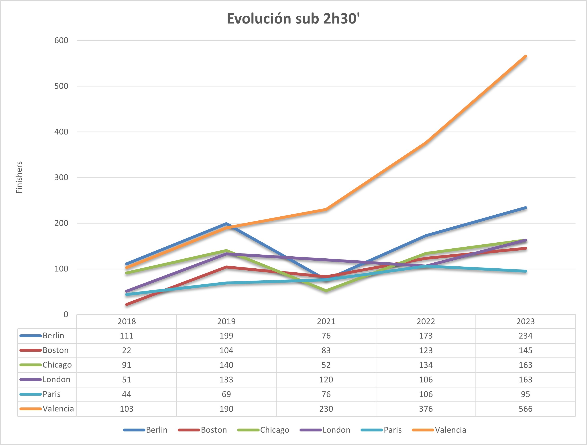
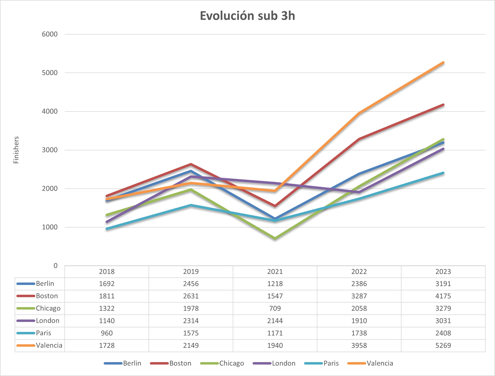

El [maratón de Valencia ](https://www.valenciaciudaddelrunning.com/maraton/maraton/) se está convirtiendo, por méritos propios, en uno de los maratones más rápidos del mundo, ya no solo por las marcas que realizan los corredores de la élite, sino también por los resultados obtenidos por los corredores populares.

Una muestra de ello es la cantidad de corredores que llegan a meta por debajo de marcas como 2h30' o 3h, tiempos a batir por muchos corredores que entrenan duro para ello.

En estas gráficas podemos observar la evolución de corredores que han terminado por debajo de las 2h30'desde la edición de 2018 a la de 2023. Para ello se comparan los maratones más importantes del mundo: Berlín, Boston, Chicago, Londres, París y Valencia.

Si en 2018 y en 2019 la carrera con más finishers sub 2h30' era Berlín con 111 y 199 respectivamente, a partir de 2021 se ha afianzado en la primera plaza, llegando a los 566 en 2023, más del doble que el segundo, Berlín con 234.

Hay que tener en cuenta, que en 2021 algunos maratones tuvieron más restricciones que otros por la pandemia de COVID-19, en función de la fecha de celebración.

En cuanto a corredores sub 3 horas, era Boston en 2018 y 2019 el que ocupaba la primera plaza, con 1811 y 2631, respectivamente. Valencia en 2019 ocupaba la cuarta plaza, con 2149, en tan solo 3 ediciones ha multiplicado esa cantidad casi por 2,5. 

Sin duda, el crecimiento de Valencia en cuanto a rendimiento de corredores es espectacular, y por ello, no es de extrañar que tantos atletas a nivel mundial vengan a Valencia a batir sus récords nacionales o conseguir mínimas para campeonatos mundiales o juegos olímpicos.

<!-- Insertar tabla de resultados -->
Datos sub 2h30'
<table>
  <thead>
    <tr>
      <th rowspan="2">City</th>
      <th colspan="5">Years</th>
    </tr>
    <tr>
      <th>2018</th>
      <th>2019</th>
      <th>2021</th>
      <th>2022</th>
      <th>2023</th>
    </tr>
  </thead>
  <tbody>
    <tr>
      <td>Berlin</td>
      <td>111</td>
      <td>199</td>
      <td>76</td>
      <td>173</td>
      <td>234</td>
    </tr>
    <tr>
      <td>Boston</td>
      <td>22</td>
      <td>104</td>
      <td>83</td>
      <td>123</td>
      <td>145</td>
    </tr>
    <tr>
      <td>Chicago</td>
      <td>91</td>
      <td>140</td>
      <td>52</td>
      <td>134</td>
      <td>163</td>
    </tr>
    <tr>
      <td>London</td>
      <td>51</td>
      <td>133</td>
      <td>120</td>
      <td>106</td>
      <td>163</td>
    </tr>
    <tr>
      <td>Paris</td>
      <td>44</td>
      <td>69</td>
      <td>76</td>
      <td>106</td>
      <td>95</td>
    </tr>
    <tr>
      <td>Valencia</td>
      <td>103</td>
      <td>190</td>
      <td>230</td>
      <td>376</td>
      <td>566</td>
    </tr>
  </tbody>
</table>

Datos sub 3 horas
<table>
  <thead>
    <tr>
      <th rowspan="2">City</th>
      <th colspan="5">Years</th>
    </tr>
    <tr>
      <th>2018</th>
      <th>2019</th>
      <th>2021</th>
      <th>2022</th>
      <th>2023</th>
    </tr>
  </thead>
  <tbody>
    <tr>
      <td>Berlin</td>
      <td>1692</td>
      <td>2456</td>
      <td>1218</td>
      <td>2386</td>
      <td>3191</td>
    </tr>
    <tr>
      <td>Boston</td>
      <td>1811</td>
      <td>2631</td>
      <td>1547</td>
      <td>3287</td>
      <td>4175</td>
    </tr>
    <tr>
      <td>Chicago</td>
      <td>1322</td>
      <td>1978</td>
      <td>709</td>
      <td>2058</td>
      <td>3279</td>
    </tr>
    <tr>
      <td>London</td>
      <td>1140</td>
      <td>2314</td>
      <td>2144</td>
      <td>1910</td>
      <td>3031</td>
    </tr>
    <tr>
      <td>Paris</td>
      <td>960</td>
      <td>1575</td>
      <td>1171</td>
      <td>1738</td>
      <td>2408</td>
    </tr>
    <tr>
      <td>Valencia</td>
      <td>1728</td>
      <td>2149</td>
      <td>1940</td>
      <td>3958</td>
      <td>5269</td>
    </tr>
  </tbody>
</table>

