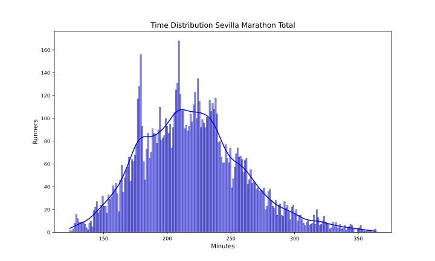
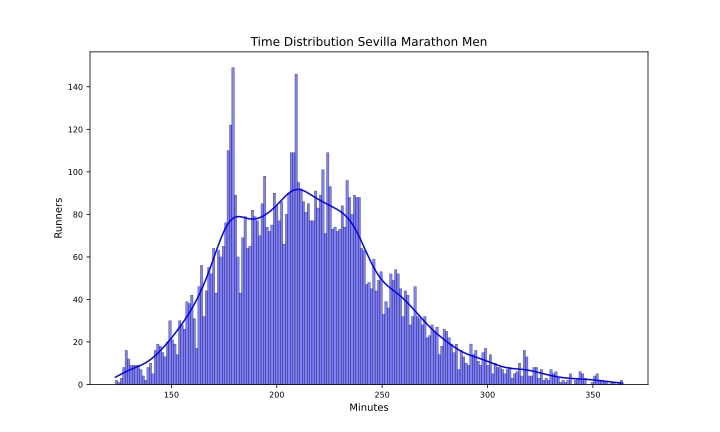
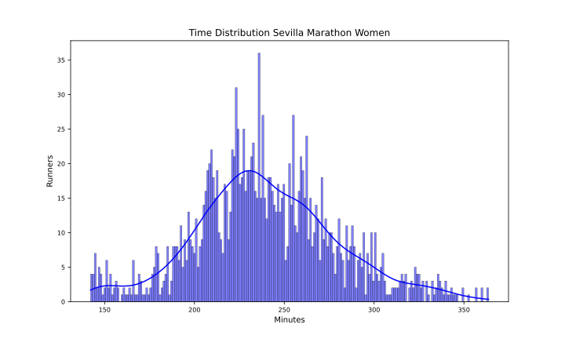

Sevilla 2024
============

# Datos del maratón de Sevilla 2024 Fecha: 18/02/24

El maratón de Sevilla 2024 ha tenido 9396 finishers, de los que 1613 fueron mujeres, lo que supone un 17.17% del total.

El tiempo medio de todos los participantes ha sido 3:39:42, el de los hombres 3:35:30 y el de las mujeres 4:00:00.

El tiempo medio del 10% más rápido ha sido 2:35:30, y el del 25% 2:50:24.El tiempo medio de los 100 primeros ha sido 2:11:48, y para los 1000 primeros 2:36:24.

En esta tabla se resume el número de finishers por espacios de tiempos y el porcentaje respecto al total:  

|Tiempo|Finishers|%|
| :---: | :---: | :---: |
|Sub2:10|41|0.44|
|Sub2:20|106|1.13|
|Sub2:30|277|2.95|
|Sub2:45|713|7.59|
|Sub3:00|1712|18.22|
|Sub3:30|4067|43.28|
|Sub4:00|6791|72.28|
|Over4:00|2605|27.72|

Por último, en cuanto al resumen general, la primera media maratón tiene un tiempo medio de 1:45:12 y la segunda de 1:54:36 con un 12.7% de Negative Pace. Para los hombres, la primera media maratón tiene un tiempo medio de 1:43:06 y la segunda de 1:52:30 con un 12.72% de Negative Pace. Y para las mujeres, la primera media maratón tiene un tiempo medio de 1:55:18 y la segunda de 2:04:42 con un 12.59% de Negative Pace.

Las siguientes imágenes muestran la distribución de tiempos de los corredores en el maratón por género:  
  
  

## Datos por grupo de edad y género

A continuación se muestran los datos de los corredores por grupos de edad y género:
### Resultados por grupos de edad en hombres
  

| AgeGroup   |     % | Mean    | Min     | Max     |
|:-----------|------:|:--------|:--------|:--------|
| 23-34      | 22.66 | 3:24:30 | 2:03:24 | 5:43:00 |
| 40-44      | 18.9  | 3:30:18 | 2:09:42 | 5:52:24 |
| 45-49      | 18.27 | 3:37:48 | 2:22:06 | 5:43:36 |
| 35-39      | 14.74 | 3:26:06 | 2:03:48 | 5:58:24 |
| 50-54      | 13.13 | 3:44:36 | 2:24:18 | 6:04:06 |
| 55-59      |  6.78 | 3:55:36 | 2:35:06 | 6:02:54 |
| 60-64      |  3.2  | 4:04:54 | 2:56:42 | 6:04:06 |
| 65-69      |  1.05 | 4:26:00 | 3:05:06 | 5:55:06 |
| 20-22      |  0.59 | 3:57:00 | 2:38:30 | 5:30:12 |
| 70-74      |  0.44 | 4:33:18 | 3:20:00 | 5:53:54 |
| 18-19      |  0.19 | 3:47:18 | 2:36:48 | 4:29:12 |
| 75-79      |  0.04 | 4:59:06 | 4:33:36 | 5:43:42 |  

### Resultados por grupos de edad en mujeres
  

| AgeGroup   |     % | Mean    | Min     | Max     |
|:-----------|------:|:--------|:--------|:--------|
| 23-34      | 31.62 | 3:52:30 | 2:22:12 | 6:02:54 |
| 40-44      | 18.16 | 3:56:54 | 2:28:00 | 5:46:18 |
| 45-49      | 16.43 | 4:04:30 | 3:04:06 | 6:03:42 |
| 35-39      | 13.58 | 3:47:54 | 2:27:24 | 5:35:06 |
| 50-54      | 11.53 | 4:15:48 | 3:00:24 | 5:57:18 |
| 55-59      |  5.89 | 4:18:12 | 3:07:48 | 5:37:30 |
| 60-64      |  1.43 | 4:50:12 | 3:10:42 | 5:49:48 |
| 20-22      |  0.56 | 3:41:24 | 2:28:06 | 5:36:18 |
| 65-69      |  0.43 | 4:57:12 | 4:15:30 | 5:42:54 |
| 18-19      |  0.25 | 4:09:18 | 3:52:48 | 4:21:06 |
| 70-74      |  0.06 | 3:43:18 | 3:43:18 | 3:43:18 |
| 75-79      |  0.06 | 4:43:48 | 4:43:48 | 4:43:48 |  

## Datos por tramos de 5 kms

A continuación se muestran los datos de los corredores por tramos de 5 kms: 5K, 10K, 15K, 20K, 25K, 30K, 35K y 40K.

El porcentaje de errores de chip por cada punto de control es:  

|Punto|%|
| :---: | :---: |
|05K|1.26|
|10K|0.44|
|15K|4.38|
|20K|1.19|
|HALF|0.0|
|25K|3.07|
|30K|0.24|
|35K|0.68|
|40K|2.78|

Eliminamos los corredores con errores en algún punto de control.

El tramo de 5K más rápido ha sido: 14:12 del atleta BENSON TUNYO MURKOMEN en el punto 35Km.

En la siguiente tabla se muestran los tiempos medios y más rápidos de los hombres por tramos de 5 kms:

| Point   | Mean    | Min     |
|:--------|:--------|:--------|
| 05Km    | 0:24:24 | 0:14:30 |
| 10Km    | 0:24:12 | 0:14:24 |
| 15Km    | 0:24:24 | 0:14:42 |
| 20Km    | 0:24:30 | 0:14:48 |
| 25Km    | 0:24:48 | 0:14:54 |
| 30Km    | 0:25:24 | 0:14:12 |
| 35Km    | 0:27:00 | 0:14:12 |
| 40Km    | 0:28:12 | 0:14:30 |

El tramo de 5K más rápido ha sido: 16:30 de la atleta AZMERA GEBRU HAGOS en el punto 40Km.

En la siguiente tabla se muestran los tiempos medios y más rápidos de las mujeres por tramos de 5 kms:

| Point   | Mean    | Min     |
|:--------|:--------|:--------|
| 05Km    | 0:27:12 | 0:16:48 |
| 10Km    | 0:27:06 | 0:16:54 |
| 15Km    | 0:27:18 | 0:17:00 |
| 20Km    | 0:27:36 | 0:17:00 |
| 25Km    | 0:28:12 | 0:16:48 |
| 30Km    | 0:28:48 | 0:16:42 |
| 35Km    | 0:30:12 | 0:17:00 |
| 40Km    | 0:30:36 | 0:16:30 |

Para terminar con el estudio de los tramos de 5 kms, en las siguientes tablas se muestra el porcentaje de corredores que han hecho el tramo más rápido y más lento:

| PointMin   |     % |
|:-----------|------:|
| 10Km       | 34.26 |
| 05Km       | 18.51 |
| 30Km       | 12.39 |
| 20Km       | 12.31 |
| 15Km       |  9.07 |
| 25Km       |  6.69 |
| 40Km       |  5.88 |
| 35Km       |  0.89 |  

| PointMax   |     % |
|:-----------|------:|
| 40Km       | 64.44 |
| 35Km       | 21.33 |
| 05Km       |  7.22 |
| 30Km       |  1.92 |
| 15Km       |  1.72 |
| 25Km       |  1.3  |
| 10Km       |  1.09 |
| 20Km       |  0.97 |