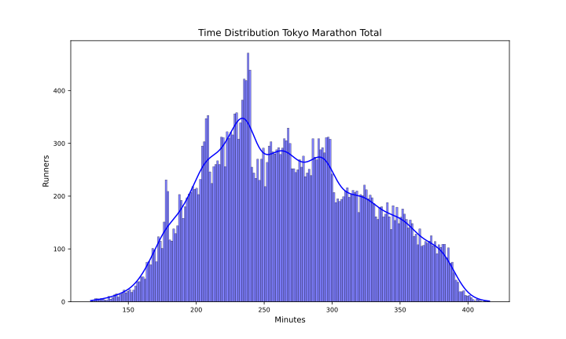
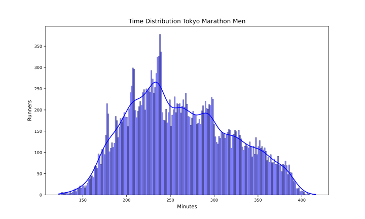
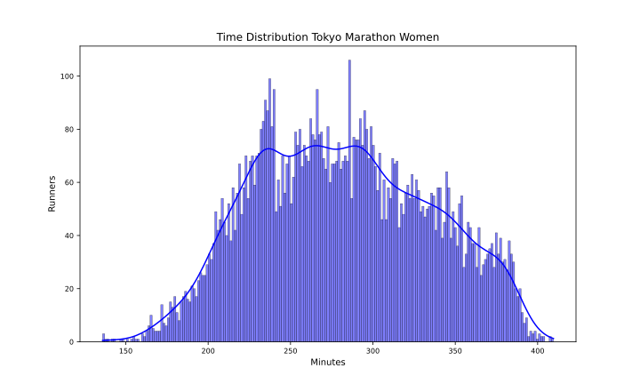

Tokyo 2024
==========

# Datos del maratón de Tokyo 2024 Fecha: 03/03/24

El maratón de Tokyo 2024 ha tenido 35401 finishers, de los que 8728 fueron mujeres, lo que supone un 24.65% del total.

El tiempo medio de todos los participantes ha sido 4:27:06, el de los hombres 4:22:18 y el de las mujeres 4:41:48.

El tiempo medio del 10% más rápido ha sido 2:56:54, y el del 25% 3:16:18.El tiempo medio de los 100 primeros ha sido 2:15:48, y para los 1000 primeros 2:39:36.

En esta tabla se resume el número de finishers por espacios de tiempos y el porcentaje respecto al total:  

|Tiempo|Finishers|%|
| :---: | :---: | :---: |
|Sub2:10|21|0.06|
|Sub2:20|69|0.19|
|Sub2:30|183|0.52|
|Sub2:45|600|1.69|
|Sub3:00|1922|5.43|
|Sub3:30|6399|18.08|
|Sub4:00|13350|37.71|
|Over4:00|22051|62.29|

Por último, en cuanto al resumen general, la primera media maratón tiene un tiempo medio de 2:04:30 y la segunda de 2:22:36 con un 8.58% de Negative Pace. Para los hombres, la primera media maratón tiene un tiempo medio de 2:01:42 y la segunda de 2:20:36 con un 8.41% de Negative Pace. Y para las mujeres, la primera media maratón tiene un tiempo medio de 2:13:00 y la segunda de 2:28:48 con un 9.11% de Negative Pace.

Las siguientes imágenes muestran la distribución de tiempos de los corredores en el maratón por género:  
  
  

## Datos por grupo de edad y género

A continuación se muestran los datos de los corredores por grupos de edad y género:
### Resultados por grupos de edad en hombres
  

| AgeGroup   |     % | Mean    | Min     | Max     |
|:-----------|------:|:--------|:--------|:--------|
| 50-54      | 18.22 | 4:19:42 | 2:28:00 | 6:47:00 |
| 45-49      | 16.46 | 4:16:36 | 2:25:48 | 6:55:48 |
| 55-59      | 14.87 | 4:31:30 | 2:38:18 | 6:43:48 |
| 40-44      | 14.08 | 4:09:00 | 2:17:30 | 6:46:12 |
| 23-34      | 11.24 | 4:11:24 | 2:02:18 | 6:43:18 |
| 35-39      |  9.79 | 4:11:24 | 2:06:48 | 6:54:48 |
| 60-64      |  9.05 | 4:41:12 | 2:50:06 | 6:46:12 |
| 65-69      |  3.9  | 4:58:36 | 2:57:54 | 6:52:24 |
| 70-74      |  1.39 | 5:13:48 | 3:11:12 | 6:36:30 |
| 75-79      |  0.48 | 5:31:48 | 3:33:30 | 6:38:36 |
| 20-22      |  0.44 | 4:27:06 | 2:23:54 | 6:39:24 |
| 18-19      |  0.09 | 4:48:24 | 3:10:48 | 6:04:48 |  

### Resultados por grupos de edad en mujeres
  

| AgeGroup   |     % | Mean    | Min     | Max     |
|:-----------|------:|:--------|:--------|:--------|
| 50-54      | 18.23 | 4:41:48 | 2:49:00 | 6:43:00 |
| 45-49      | 17.16 | 4:37:18 | 2:39:48 | 6:40:36 |
| 23-34      | 14.38 | 4:33:42 | 2:15:54 | 6:41:06 |
| 40-44      | 14.26 | 4:37:36 | 2:43:12 | 6:49:36 |
| 55-59      | 13.57 | 4:48:48 | 3:02:06 | 6:42:42 |
| 35-39      | 11.06 | 4:33:18 | 2:19:18 | 6:38:42 |
| 60-64      |  7.49 | 4:55:54 | 3:06:48 | 6:34:24 |
| 65-69      |  2.58 | 5:14:06 | 3:01:12 | 6:32:54 |
| 70-74      |  0.78 | 5:32:00 | 4:09:18 | 6:30:06 |
| 20-22      |  0.31 | 5:14:24 | 3:21:30 | 6:47:06 |
| 75-79      |  0.16 | 5:46:24 | 4:28:00 | 6:23:54 |
| -          |  0.01 | 4:50:06 | 4:50:06 | 4:50:06 |
| 18-19      |  0.01 | 5:22:48 | 5:22:48 | 5:22:48 |  

## Datos por tramos de 5 kms

A continuación se muestran los datos de los corredores por tramos de 5 kms: 5K, 10K, 15K, 20K, 25K, 30K, 35K y 40K.

El porcentaje de errores de chip por cada punto de control es:  

|Punto|%|
| :---: | :---: |
|05K|0.03|
|10K|0.0|
|15K|0.0|
|20K|0.04|
|HALF|0.01|
|25K|0.0|
|30K|0.01|
|35K|0.0|
|40K|0.05|

Eliminamos los corredores con errores en algún punto de control.

El tramo de 5K más rápido ha sido: 14:12 del atleta ＶＩＮＣＥＮＴ　ＫＩＰＫＥＭＯＩ ＮＧＥＴＩＣＨ en el punto 10Km.

En la siguiente tabla se muestran los tiempos medios y más rápidos de los hombres por tramos de 5 kms:

| Point   | Mean    | Min     |
|:--------|:--------|:--------|
| 05Km    | 0:28:18 | 0:14:18 |
| 10Km    | 0:28:12 | 0:14:12 |
| 15Km    | 0:28:48 | 0:14:24 |
| 20Km    | 0:29:48 | 0:14:24 |
| 25Km    | 0:30:42 | 0:14:24 |
| 30Km    | 0:32:18 | 0:14:30 |
| 35Km    | 0:33:48 | 0:14:48 |
| 40Km    | 0:35:30 | 0:14:48 |

El tramo de 5K más rápido ha sido: 15:54 de la atleta ＳＩＦＡＮ ＨＡＳＳＡＮ en el punto 25Km.

En la siguiente tabla se muestran los tiempos medios y más rápidos de las mujeres por tramos de 5 kms:

| Point   | Mean    | Min     |
|:--------|:--------|:--------|
| 05Km    | 0:30:36 | 0:16:18 |
| 10Km    | 0:30:42 | 0:16:06 |
| 15Km    | 0:31:36 | 0:16:12 |
| 20Km    | 0:32:42 | 0:16:06 |
| 25Km    | 0:33:36 | 0:15:54 |
| 30Km    | 0:34:42 | 0:16:00 |
| 35Km    | 0:35:36 | 0:16:00 |
| 40Km    | 0:36:48 | 0:16:00 |

Para terminar con el estudio de los tramos de 5 kms, en las siguientes tablas se muestra el porcentaje de corredores que han hecho el tramo más rápido y más lento:

| PointMin   |     % |
|:-----------|------:|
| 10Km       | 41.39 |
| 05Km       | 31.49 |
| 15Km       | 13.81 |
| 25Km       |  4.28 |
| 20Km       |  3.11 |
| 40Km       |  2.35 |
| 30Km       |  2.17 |
| 35Km       |  1.39 |  

| PointMax   |     % |
|:-----------|------:|
| 40Km       | 62.56 |
| 35Km       | 14.31 |
| 30Km       |  6.51 |
| 05Km       |  5.41 |
| 20Km       |  3.73 |
| 25Km       |  3.62 |
| 15Km       |  2.6  |
| 10Km       |  1.26 |