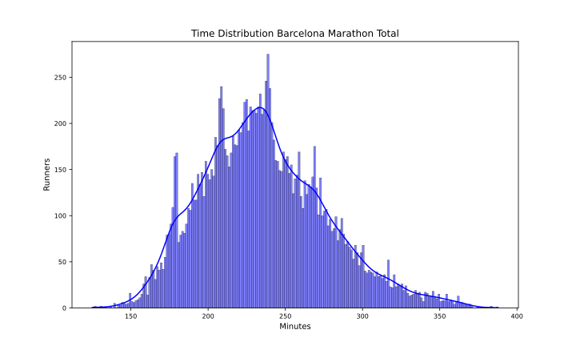
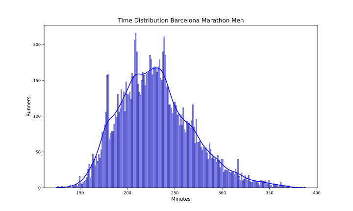
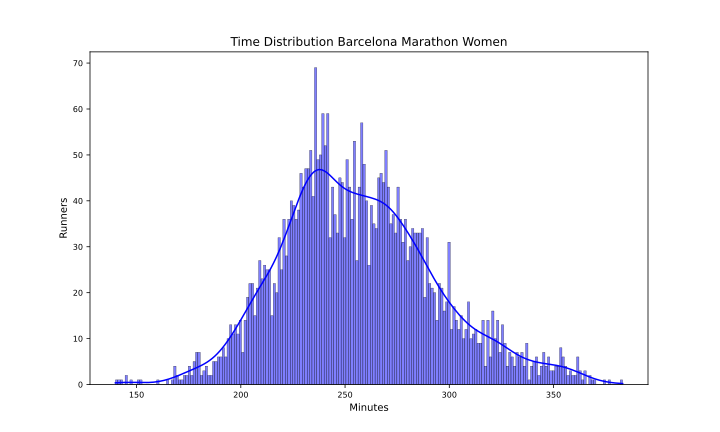

Barcelona 2024
===========

# Datos del maratón de Barcelona 2024 Fecha: 10/03/24

El maratón de Barcelona 2024 ha tenido 16097 finishers, de los que 3553 fueron mujeres, lo que supone un 22.07% del total.

El tiempo medio de todos los participantes ha sido 3:56:12, el de los hombres 3:50:24 y el de las mujeres 4:16:36.

El tiempo medio del 10% más rápido ha sido 2:53:30, y el del 25% 3:08:00.El tiempo medio de los 100 primeros ha sido 2:28:24, y para los 1000 primeros 2:48:30.

En esta tabla se resume el número de finishers por espacios de tiempos y el porcentaje respecto al total:  

|Tiempo|Finishers|%|
| :---: | :---: | :---: |
|Sub2:10|4|0.02|
|Sub2:20|13|0.08|
|Sub2:30|55|0.34|
|Sub2:45|299|1.86|
|Sub3:00|1233|7.66|
|Sub3:30|4494|27.92|
|Sub4:00|9369|58.2|
|Over4:00|6728|41.8|

Por último, en cuanto al resumen general, la primera media maratón tiene un tiempo medio de 1:53:36 y la segunda de 2:02:36 con un 12.41% de Negative Pace. Para los hombres, la primera media maratón tiene un tiempo medio de 1:50:36 y la segunda de 1:59:48 con un 12.24% de Negative Pace. Y para las mujeres, la primera media maratón tiene un tiempo medio de 2:04:06 y la segunda de 2:12:30 con un 13.0% de Negative Pace.

Las siguientes imágenes muestran la distribución de tiempos de los corredores en el maratón por género:  
  
  

## Datos por grupo de edad y género

A continuación se muestran los datos de los corredores por grupos de edad y género:
### Resultados por grupos de edad en hombres
  

| AgeGroup   |     % | Mean    | Min     | Max     |
|:-----------|------:|:--------|:--------|:--------|
| 23-34      | 32.81 | 3:46:42 | 2:07:18 | 6:27:48 |
| 45-49      | 14.64 | 3:48:24 | 2:29:06 | 6:11:00 |
| 40-44      | 14.09 | 3:45:18 | 2:05:00 | 6:09:00 |
| 35-39      | 13.8  | 3:42:48 | 2:10:18 | 6:06:12 |
| 50-54      | 10.38 | 3:52:54 | 2:29:36 | 6:02:00 |
| 55-59      |  5.94 | 4:08:30 | 2:38:54 | 6:23:12 |
| 18-22      |  4.19 | 4:03:48 | 2:06:42 | 6:08:36 |
| 60-64      |  2.74 | 4:18:24 | 2:58:36 | 6:04:48 |
| 65-69      |  1.04 | 4:28:36 | 2:58:48 | 6:06:06 |
| 70-74      |  0.29 | 4:44:54 | 3:48:54 | 6:10:06 |
| 75-79      |  0.02 | 6:01:06 | 5:47:54 | 6:14:18 |  

### Resultados por grupos de edad en mujeres
  

| AgeGroup   |     % | Mean    | Min     | Max     |
|:-----------|------:|:--------|:--------|:--------|
| 23-34      | 38.05 | 4:13:24 | 2:19:48 | 6:07:12 |
| 45-49      | 13.96 | 4:17:00 | 2:52:18 | 6:08:42 |
| 40-44      | 13.82 | 4:12:24 | 2:54:18 | 6:02:42 |
| 35-39      | 13.68 | 4:10:36 | 2:48:18 | 6:07:30 |
| 50-54      |  9.09 | 4:24:48 | 2:50:06 | 6:05:00 |
| 55-59      |  4.45 | 4:33:12 | 3:08:30 | 6:23:06 |
| 18-22      |  3.91 | 4:25:00 | 3:11:00 | 6:10:00 |
| 60-64      |  1.52 | 4:42:54 | 3:19:30 | 5:58:00 |
| 65-69      |  0.68 | 4:47:48 | 3:45:24 | 5:40:18 |
| 70-74      |  0.08 | 5:35:06 | 5:14:54 | 5:57:36 |  

## Datos por tramos de 5 kms

A continuación se muestran los datos de los corredores por tramos de 5 kms: 5K, 10K, 15K, 20K, 25K, 30K, 35K y 40K.

El porcentaje de errores de chip por cada punto de control es:  

|Punto|%|
| :---: | :---: |
|05K|0.17|
|10K|0.42|
|15K|0.12|
|20K|0.42|
|HALF|0.09|
|25K|0.47|
|30K|0.37|
|35K|0.57|
|40K|0.47|

Eliminamos los corredores con errores en algún punto de control.

El tramo de 5K más rápido ha sido: 14:36 del atleta COLLINS KIPKURUI KIPKORIR en el punto 25Km.

En la siguiente tabla se muestran los tiempos medios y más rápidos de los hombres por tramos de 5 kms:

| Point   | Mean    | Min     |
|:--------|:--------|:--------|
| 05Km    | 0:25:54 | 0:14:42 |
| 10Km    | 0:25:48 | 0:14:42 |
| 15Km    | 0:25:54 | 0:15:00 |
| 20Km    | 0:26:00 | 0:14:48 |
| 25Km    | 0:26:30 | 0:14:36 |
| 30Km    | 0:28:06 | 0:14:48 |
| 35Km    | 0:28:54 | 0:14:48 |
| 40Km    | 0:30:30 | 0:14:48 |

El tramo de 5K más rápido ha sido: 16:12 de la atleta DEGITU AZIMERAW en el punto 30Km.

En la siguiente tabla se muestran los tiempos medios y más rápidos de las mujeres por tramos de 5 kms:

| Point   | Mean    | Min     |
|:--------|:--------|:--------|
| 05Km    | 0:28:48 | 0:16:36 |
| 10Km    | 0:28:54 | 0:16:24 |
| 15Km    | 0:29:00 | 0:16:36 |
| 20Km    | 0:29:24 | 0:16:36 |
| 25Km    | 0:30:00 | 0:16:30 |
| 30Km    | 0:31:42 | 0:16:12 |
| 35Km    | 0:31:54 | 0:16:36 |
| 40Km    | 0:33:00 | 0:17:00 |

Para terminar con el estudio de los tramos de 5 kms, en las siguientes tablas se muestra el porcentaje de corredores que han hecho el tramo más rápido y más lento:

| PointMin   |     % |
|:-----------|------:|
| 10Km       | 29.75 |
| 05Km       | 23.16 |
| 20Km       | 17.22 |
| 15Km       | 11.57 |
| 25Km       |  9.88 |
| 35Km       |  3.95 |
| 40Km       |  3.24 |
| 30Km       |  1.24 |  

| PointMax   |     % |
|:-----------|------:|
| 40Km       | 70.92 |
| 30Km       |  8.97 |
| 35Km       |  7.64 |
| 05Km       |  6.12 |
| 10Km       |  2.28 |
| 25Km       |  1.53 |
| 15Km       |  1.53 |
| 20Km       |  1.02 |