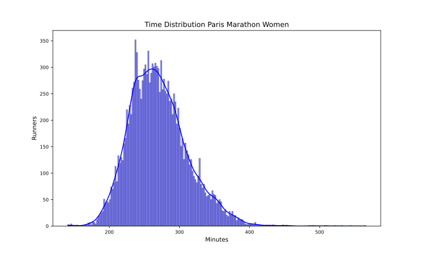

Paris 2024
==========

# Datos del maratón de Paris 2024 Fecha: 07/04/24

El maratón de Paris 2024 ha tenido 53899 finishers, de los que 14692 fueron mujeres, lo que supone un 27.26% del total.

El tiempo medio de todos los participantes ha sido 4:11:06, el de los hombres 4:03:54 y el de las mujeres 4:30:18.

El tiempo medio del 10% más rápido ha sido 3:02:18, y el del 25% 3:18:36.El tiempo medio de los 100 primeros ha sido 2:24:54, y para los 1000 primeros 2:43:24.

En esta tabla se resume el número de finishers por espacios de tiempos y el porcentaje respecto al total:  

|Tiempo|Finishers|%|
| :---: | :---: | :---: |
|Sub2:10|9|0.02|
|Sub2:20|13|0.02|
|Sub2:30|85|0.16|
|Sub2:45|477|0.88|
|Sub3:00|2138|3.97|
|Sub3:30|9553|17.72|
|Sub4:00|23885|44.31|
|Over4:00|30014|55.69|

Por último, en cuanto al resumen general, la primera media maratón tiene un tiempo medio de 1:57:00 y la segunda de 2:14:06 con un 7.35% de Negative Pace. Para los hombres, la primera media maratón tiene un tiempo medio de 1:53:06 y la segunda de 2:10:42 con un 7.17% de Negative Pace. Y para las mujeres, la primera media maratón tiene un tiempo medio de 2:07:06 y la segunda de 2:23:06 con un 7.81% de Negative Pace.

Las siguientes imágenes muestran la distribución de tiempos de los corredores en el maratón por género:  
  
  

## Datos por grupo de edad y género

A continuación se muestran los datos de los corredores por grupos de edad y género:
### Resultados por grupos de edad en hombres
  

| AgeGroup   |     % | Mean    | Min     | Max     |
|:-----------|------:|:--------|:--------|:--------|
| 23-29      | 23.41 | 3:56:54 | 2:05:36 | 8:21:06 |
| 30-34      | 15.78 | 3:56:12 | 2:06:54 | 9:06:30 |
| 35-39      | 13.3  | 3:58:18 | 2:14:30 | 7:16:42 |
| 40-44      | 12.47 | 4:01:36 | 2:20:24 | 8:20:48 |
| 45-49      | 10.89 | 4:07:18 | 2:25:30 | 9:30:00 |
| 50-54      |  9.38 | 4:14:36 | 2:27:42 | 7:49:12 |
| 55-59      |  5.76 | 4:22:18 | 2:41:06 | 7:39:48 |
| 18-22      |  5.01 | 4:05:06 | 2:08:42 | 7:05:30 |
| 60-64      |  2.79 | 4:31:12 | 2:55:06 | 7:13:42 |
| 65-69      |  0.83 | 4:44:18 | 3:04:42 | 7:05:00 |
| 70-74      |  0.31 | 4:57:12 | 3:09:42 | 7:27:18 |
| 75-79      |  0.06 | 5:24:18 | 3:20:36 | 7:08:12 |
| 80+        |  0.02 | 6:09:30 | 5:12:24 | 7:29:36 |  

### Resultados por grupos de edad en mujeres
  

| AgeGroup   |     % | Mean    | Min     | Max     |
|:-----------|------:|:--------|:--------|:--------|
| 23-29      | 27.49 | 4:22:00 | 2:20:48 | 8:51:36 |
| 30-34      | 15.61 | 4:24:06 | 2:24:48 | 8:12:12 |
| 40-44      | 13.05 | 4:31:18 | 2:21:48 | 7:33:18 |
| 35-39      | 12.39 | 4:28:36 | 2:34:00 | 9:25:48 |
| 45-49      | 11.7  | 4:34:06 | 2:57:42 | 9:04:30 |
| 50-54      |  8.73 | 4:41:48 | 3:08:54 | 7:39:48 |
| 55-59      |  4.77 | 4:49:54 | 3:08:12 | 7:33:06 |
| 18-22      |  3.77 | 4:31:48 | 2:56:18 | 6:29:48 |
| 60-64      |  1.83 | 4:57:36 | 3:24:06 | 7:37:24 |
| 65-69      |  0.52 | 5:19:30 | 3:17:30 | 8:28:54 |
| 70-74      |  0.12 | 5:42:54 | 3:54:30 | 8:28:48 |
| 75-79      |  0.02 | 6:21:42 | 6:15:24 | 6:30:30 |
| 80+        |  0.01 | 6:43:48 | 6:43:48 | 6:43:48 |  

## Datos por tramos de 5 kms

A continuación se muestran los datos de los corredores por tramos de 5 kms: 5K, 10K, 15K, 20K, 25K, 30K, 35K y 40K.

El porcentaje de errores de chip por cada punto de control es:  

|Punto|%|
| :---: | :---: |
|05K|0.18|
|10K|0.46|
|15K|0.56|
|20K|0.42|
|HALF|0.38|
|25K|0.4|
|30K|0.47|
|35K|0.69|
|40K|0.76|

Eliminamos los corredores con errores en algún punto de control.

El tramo de 5K más rápido ha sido: 14:24 del atleta Abeje AYANA en el punto 05Km.

En la siguiente tabla se muestran los tiempos medios y más rápidos de los hombres por tramos de 5 kms:

| Point   | Mean    | Min     |
|:--------|:--------|:--------|
| 05Km    | 0:26:30 | 0:14:24 |
| 10Km    | 0:26:42 | 0:14:42 |
| 15Km    | 0:26:48 | 0:14:54 |
| 20Km    | 0:27:24 | 0:14:54 |
| 25Km    | 0:28:12 | 0:14:42 |
| 30Km    | 0:29:18 | 0:14:48 |
| 35Km    | 0:31:42 | 0:15:06 |
| 40Km    | 0:33:54 | 0:15:24 |

El tramo de 5K más rápido ha sido: 16:24 de la atleta Enat TIRUSEW en el punto 30Km.

En la siguiente tabla se muestran los tiempos medios y más rápidos de las mujeres por tramos de 5 kms:

| Point   | Mean    | Min     |
|:--------|:--------|:--------|
| 05Km    | 0:29:36 | 0:16:36 |
| 10Km    | 0:30:00 | 0:16:48 |
| 15Km    | 0:30:12 | 0:16:36 |
| 20Km    | 0:31:00 | 0:16:30 |
| 25Km    | 0:32:00 | 0:16:30 |
| 30Km    | 0:32:42 | 0:16:24 |
| 35Km    | 0:34:24 | 0:16:42 |
| 40Km    | 0:36:12 | 0:17:12 |

Para terminar con el estudio de los tramos de 5 kms, en las siguientes tablas se muestra el porcentaje de corredores que han hecho el tramo más rápido y más lento:

| PointMin   |     % |
|:-----------|------:|
| 05Km       | 51.16 |
| 15Km       | 17.78 |
| 10Km       | 11.71 |
| 20Km       |  6.22 |
| 25Km       |  5.87 |
| 30Km       |  4.63 |
| 35Km       |  1.45 |
| 40Km       |  1.18 |  

| PointMax   |     % |
|:-----------|------:|
| 40Km       | 81.97 |
| 35Km       | 10.07 |
| 30Km       |  1.81 |
| 25Km       |  1.7  |
| 05Km       |  1.67 |
| 10Km       |  1.38 |
| 20Km       |  0.81 |
| 15Km       |  0.6  |