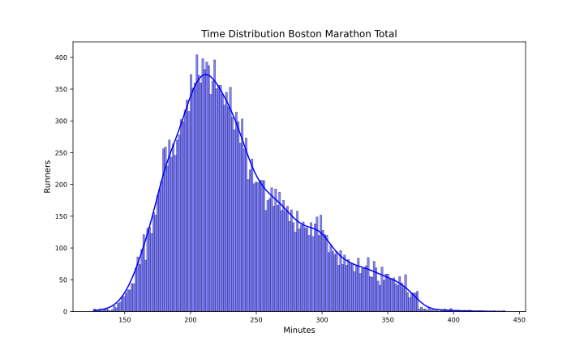
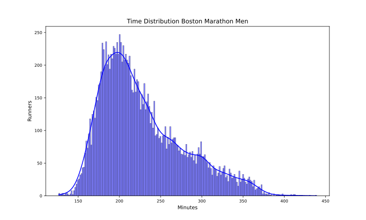
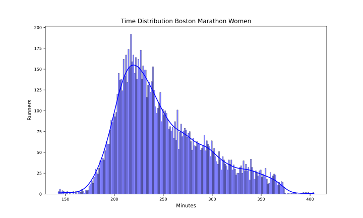

Boston 2024
===========

# Datos del maratón de Boston 2024 Fecha: 15/04/24

El maratón de Boston 2024 ha tenido 25545 finishers, de los que 10966 fueron mujeres, lo que supone un 42.93% del total.

El tiempo medio de todos los participantes ha sido 3:57:30, el de los hombres 3:48:00 y el de las mujeres 4:10:06.

El tiempo medio del 10% más rápido ha sido 2:52:24, y el del 25% 3:05:12.El tiempo medio de los 100 primeros ha sido 2:25:12, y para los 1000 primeros 2:42:30.

En esta tabla se resume el número de finishers por espacios de tiempos y el porcentaje respecto al total:  

|Tiempo|Finishers|%|
| :---: | :---: | :---: |
|Sub2:10|7|0.03|
|Sub2:20|28|0.11|
|Sub2:30|119|0.47|
|Sub2:45|731|2.86|
|Sub3:00|2321|9.09|
|Sub3:30|8548|33.46|
|Sub4:00|15370|60.17|
|Over4:00|10175|39.83|

Por último, en cuanto al resumen general, la primera media maratón tiene un tiempo medio de 1:47:42 y la segunda de 2:09:48 con un 0.66% de Negative Pace. Para los hombres, la primera media maratón tiene un tiempo medio de 1:42:30 y la segunda de 2:05:30 con un 0.62% de Negative Pace. Y para las mujeres, la primera media maratón tiene un tiempo medio de 1:54:30 y la segunda de 2:15:36 con un 0.71% de Negative Pace.

Las siguientes imágenes muestran la distribución de tiempos de los corredores en el maratón por género:  
  
  

## Datos por grupo de edad y género

A continuación se muestran los datos de los corredores por grupos de edad y género:
### Resultados por grupos de edad en hombres
  

| AgeGroup   |     % | Mean    | Min     | Max     |
|:-----------|------:|:--------|:--------|:--------|
| 18-39      | 33.25 | 3:30:06 | 2:06:18 | 6:50:48 |
| 45-49      | 15.21 | 3:45:18 | 2:27:06 | 7:02:18 |
| 40-44      | 13.77 | 3:35:12 | 2:12:30 | 7:19:06 |
| 50-54      | 13.28 | 3:55:12 | 2:40:00 | 6:53:24 |
| 55-59      | 10.49 | 4:03:12 | 2:41:42 | 6:44:12 |
| 60-64      |  8.05 | 4:17:06 | 2:49:36 | 6:58:42 |
| 65-69      |  4.23 | 4:34:18 | 3:05:06 | 7:00:36 |
| 70-74      |  1.34 | 4:57:48 | 3:27:00 | 6:48:06 |
| 75-79      |  0.29 | 5:10:48 | 3:32:48 | 6:27:30 |
| 80+        |  0.07 | 5:09:00 | 4:31:18 | 5:56:00 |  

### Resultados por grupos de edad en mujeres
  

| AgeGroup   |     % | Mean    | Min     | Max     |
|:-----------|------:|:--------|:--------|:--------|
| 18-39      | 42.48 | 4:00:06 | 2:22:36 | 6:38:18 |
| 45-49      | 15.99 | 4:07:36 | 3:00:06 | 6:13:48 |
| 40-44      | 14.68 | 4:02:24 | 2:23:24 | 6:42:48 |
| 50-54      | 10.82 | 4:21:24 | 3:08:12 | 6:43:54 |
| 55-59      |  7.99 | 4:31:18 | 3:01:06 | 6:36:06 |
| 60-64      |  5    | 4:42:36 | 3:12:24 | 6:30:36 |
| 65-69      |  1.97 | 4:59:54 | 3:28:06 | 6:36:12 |
| 70-74      |  0.56 | 5:08:18 | 3:47:12 | 6:37:42 |
| –          |  0.45 | 3:45:06 | 2:27:48 | 6:11:06 |
| 75-79      |  0.06 | 5:47:48 | 5:13:42 | 6:03:24 |
| 80+        |  0.01 | 6:05:30 | 6:05:30 | 6:05:30 |  

## Datos por tramos de 5 kms

A continuación se muestran los datos de los corredores por tramos de 5 kms: 5K, 10K, 15K, 20K, 25K, 30K, 35K y 40K.

El porcentaje de errores de chip por cada punto de control es:  

|Punto|%|
| :---: | :---: |
|05K|0.2|
|10K|0.09|
|15K|0.01|
|20K|0.01|
|HALF|0.0|
|25K|0.0|
|30K|0.0|
|35K|0.0|
|40K|0.0|

Eliminamos los corredores con errores en algún punto de control.

El tramo de 5K más rápido ha sido: 14:00 del atleta Takeuchi, Ryoma en el punto 15Km.

En la siguiente tabla se muestran los tiempos medios y más rápidos de los hombres por tramos de 5 kms:

| Point   | Mean    | Min     |
|:--------|:--------|:--------|
| 05Km    | 0:23:36 | 0:14:24 |
| 10Km    | 0:23:54 | 0:14:06 |
| 15Km    | 0:24:18 | 0:14:00 |
| 20Km    | 0:25:12 | 0:14:30 |
| 25Km    | 0:26:00 | 0:14:30 |
| 30Km    | 0:28:06 | 0:15:12 |
| 35Km    | 0:29:54 | 0:15:24 |
| 40Km    | 0:30:00 | 0:15:00 |

El tramo de 5K más rápido ha sido: 15:06 de la atleta Lokedi, Sharon en el punto 40Km.

En la siguiente tabla se muestran los tiempos medios y más rápidos de las mujeres por tramos de 5 kms:

| Point   | Mean    | Min     |
|:--------|:--------|:--------|
| 05Km    | 0:26:18 | 0:16:36 |
| 10Km    | 0:26:42 | 0:16:48 |
| 15Km    | 0:27:12 | 0:17:18 |
| 20Km    | 0:28:18 | 0:17:12 |
| 25Km    | 0:29:00 | 0:17:18 |
| 30Km    | 0:30:54 | 0:17:24 |
| 35Km    | 0:32:00 | 0:17:18 |
| 40Km    | 0:31:24 | 0:15:06 |

Para terminar con el estudio de los tramos de 5 kms, en las siguientes tablas se muestra el porcentaje de corredores que han hecho el tramo más rápido y más lento:

| PointMin   |     % |
|:-----------|------:|
| 05Km       | 59.86 |
| 10Km       | 20.35 |
| 15Km       | 11.92 |
| 25Km       |  3.04 |
| 40Km       |  2.65 |
| 20Km       |  1.93 |
| 30Km       |  0.15 |
| 35Km       |  0.1  |  

| PointMax   |     % |
|:-----------|------:|
| 35Km       | 47.74 |
| 40Km       | 37.31 |
| 30Km       | 10.82 |
| 25Km       |  1.25 |
| 20Km       |  1.04 |
| 05Km       |  1.01 |
| 10Km       |  0.42 |
| 15Km       |  0.41 |