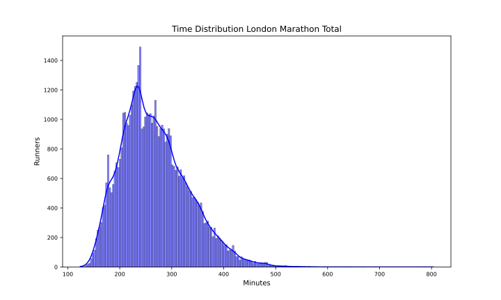
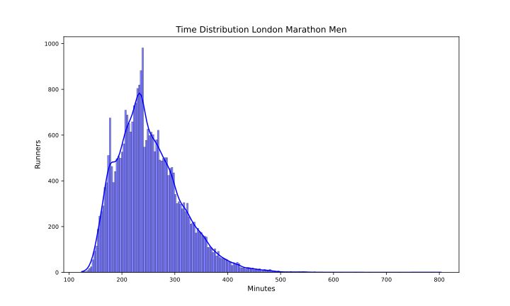
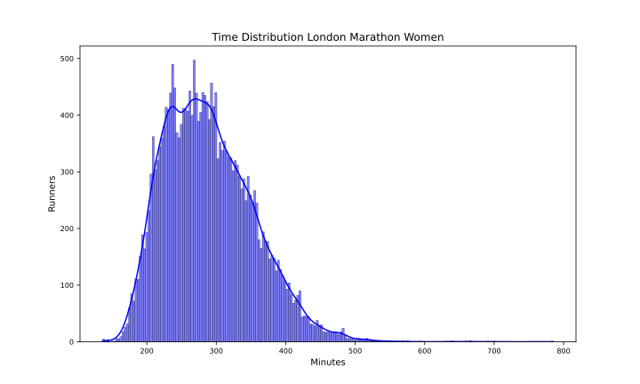

London 2024
===========

# Datos del maratón de London 2024 Fecha: 21/04/24

El maratón de London 2024 ha tenido 53878 finishers, de los que 22849 fueron mujeres, lo que supone un 42.41% del total.

El tiempo medio de todos los participantes ha sido 4:27:36, el de los hombres 4:11:36 y el de las mujeres 4:49:24.

El tiempo medio del 10% más rápido ha sido 2:53:30, y el del 25% 3:13:30.El tiempo medio de los 100 primeros ha sido 2:20:06, y para los 1000 primeros 2:34:30.

En esta tabla se resume el número de finishers por espacios de tiempos y el porcentaje respecto al total:  

|Tiempo|Finishers|%|
| :---: | :---: | :---: |
|Sub2:10|6|0.01|
|Sub2:20|42|0.08|
|Sub2:30|219|0.41|
|Sub2:45|1218|2.26|
|Sub3:00|3681|6.83|
|Sub3:30|10246|19.02|
|Sub4:00|20946|38.88|
|Over4:00|32932|61.12|

Por último, en cuanto al resumen general, la primera media maratón tiene un tiempo medio de 2:05:42 y la segunda de 2:21:54 con un 8.06% de Negative Pace. Para los hombres, la primera media maratón tiene un tiempo medio de 1:57:36 y la segunda de 2:14:00 con un 8.32% de Negative Pace. Y para las mujeres, la primera media maratón tiene un tiempo medio de 2:16:42 y la segunda de 2:32:42 con un 7.71% de Negative Pace.

Las siguientes imágenes muestran la distribución de tiempos de los corredores en el maratón por género:  
  
  

## Datos por grupo de edad y género

A continuación se muestran los datos de los corredores por grupos de edad y género:
### Resultados por grupos de edad en hombres
  

| AgeGroup   |     % | Mean    | Min     | Max      |
|:-----------|------:|:--------|:--------|:---------|
| 18-39      | 46.81 | 4:05:12 | 2:04:00 | 9:40:12  |
| 40-44      | 15.27 | 4:05:00 | 2:23:12 | 9:23:12  |
| 45-49      | 13.21 | 4:10:18 | 2:18:48 | 11:07:18 |
| 50-54      | 11.35 | 4:18:18 | 2:32:48 | 9:08:12  |
| 55-59      |  6.82 | 4:29:36 | 2:38:30 | 10:13:24 |
| 60-64      |  4.07 | 4:36:00 | 2:52:42 | 8:15:30  |
| 65-69      |  1.55 | 4:50:18 | 2:58:24 | 10:42:30 |
| 70-74      |  0.65 | 5:02:42 | 3:13:30 | 12:02:54 |
| 75-79      |  0.21 | 5:52:18 | 3:44:18 | 13:23:18 |
| 80+        |  0.05 | 6:55:54 | 3:58:18 | 13:06:54 |  

### Resultados por grupos de edad en mujeres
  

| AgeGroup   |     % | Mean    | Min     | Max      |
|:-----------|------:|:--------|:--------|:---------|
| 18-39      | 49.82 | 4:44:30 | 2:16:18 | 11:39:12 |
| 40-44      | 14.97 | 4:47:24 | 2:38:00 | 10:36:48 |
| 45-49      | 13.51 | 4:49:18 | 2:43:42 | 11:07:18 |
| 50-54      | 10.81 | 4:55:06 | 2:48:24 | 11:30:36 |
| 55-59      |  6.11 | 5:01:48 | 2:58:12 | 13:05:24 |
| 60-64      |  3.08 | 5:13:06 | 2:59:06 | 9:19:42  |
| 65-69      |  1.15 | 5:21:54 | 3:28:12 | 8:10:18  |
| 70-74      |  0.44 | 5:34:54 | 3:43:00 | 7:58:00  |
| 75-79      |  0.09 | 5:37:48 | 3:33:24 | 8:00:18  |
| 80+        |  0.02 | 6:17:24 | 5:52:48 | 6:35:54  |  

## Datos por tramos de 5 kms

A continuación se muestran los datos de los corredores por tramos de 5 kms: 5K, 10K, 15K, 20K, 25K, 30K, 35K y 40K.

El porcentaje de errores de chip por cada punto de control es:  

|Punto|%|
| :---: | :---: |
|05K|0.14|
|10K|0.15|
|15K|0.25|
|20K|0.12|
|HALF|0.14|
|25K|0.14|
|30K|0.26|
|35K|0.2|
|40K|0.27|

Eliminamos los corredores con errores en algún punto de control.

El tramo de 5K más rápido ha sido: 14:24 del atleta MUNYAO, Alexander Mutiso (KEN) en el punto 25Km.

En la siguiente tabla se muestran los tiempos medios y más rápidos de los hombres por tramos de 5 kms:

| Point   | Mean    | Min     |
|:--------|:--------|:--------|
| 05Km    | 0:27:00 | 0:14:36 |
| 10Km    | 0:27:36 | 0:14:30 |
| 15Km    | 0:28:12 | 0:14:36 |
| 20Km    | 0:28:36 | 0:14:36 |
| 25Km    | 0:29:36 | 0:14:24 |
| 30Km    | 0:30:42 | 0:14:36 |
| 35Km    | 0:32:36 | 0:14:42 |
| 40Km    | 0:32:48 | 0:14:54 |

El tramo de 5K más rápido ha sido: 15:42 de la atleta JEPKOSGEI, Joyciline (KEN) en el punto 10Km.

En la siguiente tabla se muestran los tiempos medios y más rápidos de las mujeres por tramos de 5 kms:

| Point   | Mean    | Min     |
|:--------|:--------|:--------|
| 05Km    | 0:31:06 | 0:15:42 |
| 10Km    | 0:32:00 | 0:15:42 |
| 15Km    | 0:32:54 | 0:16:12 |
| 20Km    | 0:33:30 | 0:16:00 |
| 25Km    | 0:34:42 | 0:16:00 |
| 30Km    | 0:35:36 | 0:16:18 |
| 35Km    | 0:37:06 | 0:16:54 |
| 40Km    | 0:36:30 | 0:16:24 |

Para terminar con el estudio de los tramos de 5 kms, en las siguientes tablas se muestra el porcentaje de corredores que han hecho el tramo más rápido y más lento:

| PointMin   |     % |
|:-----------|------:|
| 05Km       | 65.98 |
| 10Km       | 16.76 |
| 40Km       |  4.9  |
| 25Km       |  4.1  |
| 20Km       |  3.94 |
| 15Km       |  2.4  |
| 30Km       |  1.35 |
| 35Km       |  0.57 |  

| PointMax   |     % |
|:-----------|------:|
| 40Km       | 43.76 |
| 35Km       | 35.21 |
| 30Km       |  6.65 |
| 25Km       |  4.3  |
| 15Km       |  3.97 |
| 10Km       |  2.37 |
| 20Km       |  2.29 |
| 05Km       |  1.46 |