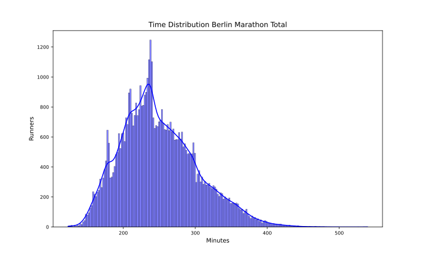
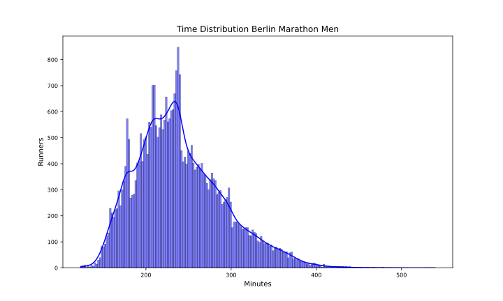
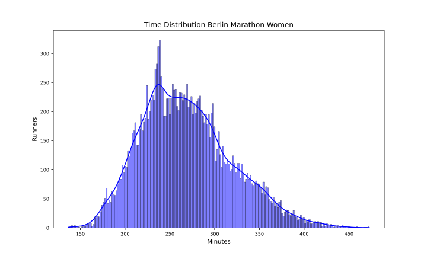

Berlin 2024
===========

# Datos del maratón de Berlin 2024 Fecha: 13/10/24

El maratón de Berlin 2024 ha tenido 54095 finishers, de los que 18572 fueron mujeres, lo que supone un 34.33% del total.

El tiempo medio de todos los participantes ha sido 4:09:42, el de los hombres 3:59:48 y el de las mujeres 4:28:48.

El tiempo medio del 10% más rápido ha sido 2:50:00, y el del 25% 3:07:54.El tiempo medio de los 100 primeros ha sido 2:15:12, y para los 1000 primeros 2:32:06.

En esta tabla se resume el número de finishers por espacios de tiempos y el porcentaje respecto al total:  

|Tiempo|Finishers|%|
| :---: | :---: | :---: |
|Sub2:10|28|0.05|
|Sub2:20|68|0.13|
|Sub2:30|303|0.56|
|Sub2:45|1574|2.91|
|Sub3:00|4556|8.42|
|Sub3:30|13010|24.05|
|Sub4:00|26325|48.66|
|Over4:00|27770|51.34|

Por último, en cuanto al resumen general, la primera media maratón tiene un tiempo medio de 1:59:24 y la segunda de 2:10:24 con un 16.96% de Negative Pace. Para los hombres, la primera media maratón tiene un tiempo medio de 1:54:18 y la segunda de 2:05:30 con un 16.73% de Negative Pace. Y para las mujeres, la primera media maratón tiene un tiempo medio de 2:09:06 y la segunda de 2:19:36 con un 17.39% de Negative Pace.

Las siguientes imágenes muestran la distribución de tiempos de los corredores en el maratón por género:  
  
  

## Datos por grupo de edad y género

A continuación se muestran los datos de los corredores por grupos de edad y género:
### Resultados por grupos de edad en hombres
  

| AgeGroup   |     % | Mean    | Min     | Max     |
|:-----------|------:|:--------|:--------|:--------|
| 40-44      | 16.01 | 3:53:54 | 2:19:36 | 7:56:48 |
| 35-39      | 15.94 | 3:48:18 | 2:12:06 | 7:46:12 |
| 30-34      | 13.96 | 3:47:12 | 2:03:24 | 7:22:12 |
| 45-49      | 13.95 | 3:57:36 | 2:25:12 | 7:55:24 |
| 50-54      | 12.34 | 4:07:00 | 2:24:18 | 7:12:24 |
| 23-29      | 10.83 | 3:52:06 | 2:03:18 | 7:40:54 |
| 55-59      |  8.61 | 4:18:42 | 2:24:06 | 7:32:30 |
| 60-64      |  5.25 | 4:27:12 | 2:48:00 | 7:58:12 |
| 65-69      |  1.87 | 4:47:54 | 2:57:36 | 7:41:18 |
| 70-74      |  0.73 | 5:11:00 | 3:28:36 | 7:36:42 |
| 18-22      |  0.24 | 4:13:48 | 2:07:48 | 6:21:48 |
| 75-79      |  0.22 | 5:28:06 | 3:37:12 | 7:58:54 |
| 80+        |  0.06 | 6:42:30 | 4:11:18 | 8:59:18 |  

### Resultados por grupos de edad en mujeres
  

| AgeGroup   |     % | Mean    | Min     | Max     |
|:-----------|------:|:--------|:--------|:--------|
| 40-44      | 16.1  | 4:27:54 | 2:28:36 | 7:52:00 |
| 45-49      | 15.11 | 4:30:42 | 2:24:42 | 7:38:18 |
| 23-29      | 15.08 | 4:18:24 | 2:16:42 | 7:48:42 |
| 30-34      | 15.07 | 4:17:12 | 2:21:24 | 7:51:00 |
| 35-39      | 14.09 | 4:22:54 | 2:27:30 | 7:31:12 |
| 50-54      | 12.02 | 4:37:00 | 2:44:36 | 7:52:42 |
| 55-59      |  6.89 | 4:48:24 | 2:55:36 | 7:18:00 |
| 60-64      |  3.75 | 4:51:18 | 3:06:30 | 7:39:18 |
| 65-69      |  1.22 | 5:06:54 | 3:35:12 | 7:33:36 |
| 70-74      |  0.4  | 5:16:36 | 3:34:48 | 7:17:06 |
| 18-22      |  0.18 | 4:49:48 | 3:26:00 | 6:24:00 |
| 75-79      |  0.07 | 5:45:30 | 4:00:42 | 7:21:00 |
| 80+        |  0.03 | 6:09:36 | 5:05:54 | 6:58:06 |  

## Datos por tramos de 5 kms

A continuación se muestran los datos de los corredores por tramos de 5 kms: 5K, 10K, 15K, 20K, 25K, 30K, 35K y 40K.

El porcentaje de errores de chip por cada punto de control es:  

|Punto|%|
| :---: | :---: |
|05K|0.23|
|10K|0.16|
|15K|0.14|
|20K|0.14|
|HALF|0.13|
|25K|0.13|
|30K|0.13|
|35K|0.12|
|40K|0.1|

Eliminamos los corredores con errores en algún punto de control.

El tramo de 5K más rápido ha sido: 14:18 del atleta Onchari, Enock (KEN) en el punto 10Km.

En la siguiente tabla se muestran los tiempos medios y más rápidos de los hombres por tramos de 5 kms:

| Point   | Mean    | Min     |
|:--------|:--------|:--------|
| 05Km    | 0:26:54 | 0:14:24 |
| 10Km    | 0:27:00 | 0:14:18 |
| 15Km    | 0:27:06 | 0:14:30 |
| 20Km    | 0:27:24 | 0:14:30 |
| 25Km    | 0:28:12 | 0:14:18 |
| 30Km    | 0:29:12 | 0:14:48 |
| 35Km    | 0:29:48 | 0:14:30 |
| 40Km    | 0:31:00 | 0:14:36 |

El tramo de 5K más rápido ha sido: 16:00 de la atleta Chen, Min (USA) en el punto 40Km.

En la siguiente tabla se muestran los tiempos medios y más rápidos de las mujeres por tramos de 5 kms:

| Point   | Mean    | Min     |
|:--------|:--------|:--------|
| 05Km    | 0:30:06 | 0:16:06 |
| 10Km    | 0:30:30 | 0:16:06 |
| 15Km    | 0:30:42 | 0:16:00 |
| 20Km    | 0:31:12 | 0:16:06 |
| 25Km    | 0:32:00 | 0:16:18 |
| 30Km    | 0:32:54 | 0:16:18 |
| 35Km    | 0:33:06 | 0:16:12 |
| 40Km    | 0:33:54 | 0:16:00 |

Para terminar con el estudio de los tramos de 5 kms, en las siguientes tablas se muestra el porcentaje de corredores que han hecho el tramo más rápido y más lento:

| PointMin   |     % |
|:-----------|------:|
| 05Km       | 35.08 |
| 10Km       | 18.42 |
| 15Km       | 15.51 |
| 20Km       |  9.95 |
| 35Km       |  7.99 |
| 40Km       |  6.94 |
| 25Km       |  3.8  |
| 30Km       |  2.3  |  

| PointMax   |     % |
|:-----------|------:|
| 40Km       | 59.29 |
| 35Km       | 10.17 |
| 30Km       | 10.07 |
| 05Km       |  8.37 |
| 25Km       |  3.5  |
| 10Km       |  3.47 |
| 15Km       |  2.85 |
| 20Km       |  2.27 |