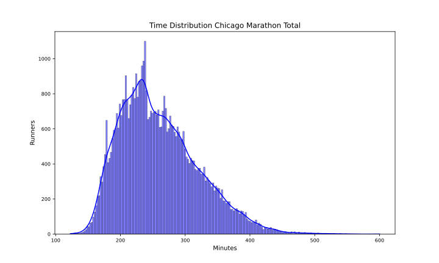
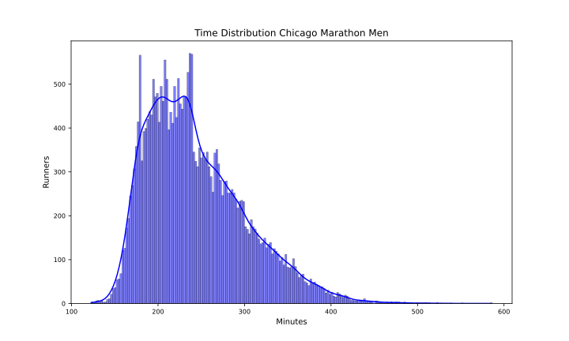
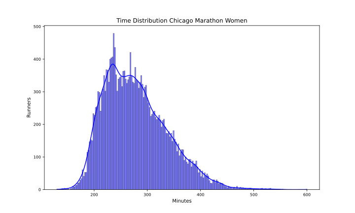

Chicago 2024
============

# Datos del maratón de Chicago 2024 Fecha: 13/10/24

El maratón de Chicago 2024 ha tenido 51860 finishers, de los que 23862 fueron mujeres, lo que supone un 46.01% del total.

El tiempo medio de todos los participantes ha sido 4:19:54, el de los hombres 4:04:12 y el de las mujeres 4:38:12.

El tiempo medio del 10% más rápido ha sido 2:55:24, y el del 25% 3:11:36.El tiempo medio de los 100 primeros ha sido 2:20:36, y para los 1000 primeros 2:38:36.

En esta tabla se resume el número de finishers por espacios de tiempos y el porcentaje respecto al total:  

|Tiempo|Finishers|%|
| :---: | :---: | :---: |
|Sub2:10|11|0.02|
|Sub2:20|35|0.07|
|Sub2:30|135|0.26|
|Sub2:45|796|1.53|
|Sub3:00|3259|6.28|
|Sub3:30|11604|22.38|
|Sub4:00|22822|44.01|
|Over4:00|29038|55.99|

Por último, en cuanto al resumen general, la primera media maratón tiene un tiempo medio de 2:02:42 y la segunda de 2:17:06 con un 11.49% de Negative Pace. Para los hombres, la primera media maratón tiene un tiempo medio de 1:54:30 y la segunda de 2:09:42 con un 10.5% de Negative Pace. Y para las mujeres, la primera media maratón tiene un tiempo medio de 2:12:18 y la segunda de 2:25:54 con un 12.66% de Negative Pace.

Las siguientes imágenes muestran la distribución de tiempos de los corredores en el maratón por género:  
  
  

## Datos por grupo de edad y género

A continuación se muestran los datos de los corredores por grupos de edad y género:
### Resultados por grupos de edad en hombres
  

| AgeGroup   |     % | Mean    | Min     | Max     |
|:-----------|------:|:--------|:--------|:--------|
| 30-34      | 16.24 | 3:54:06 | 2:04:48 | 8:13:12 |
| 40-44      | 15.57 | 3:59:24 | 2:25:06 | 8:57:36 |
| 35-39      | 15.47 | 3:55:42 | 2:11:06 | 8:32:42 |
| 25-29      | 13.37 | 3:57:36 | 2:02:42 | 8:29:36 |
| 45-49      | 12.29 | 4:05:06 | 2:24:36 | 8:04:06 |
| 50-54      | 10.56 | 4:11:54 | 2:33:00 | 8:42:48 |
| 55-59      |  6.26 | 4:24:06 | 2:38:36 | 7:59:24 |
| 60-64      |  3.92 | 4:36:18 | 2:48:30 | 9:11:24 |
| 20-24      |  3.84 | 4:00:24 | 2:04:36 | 8:08:54 |
| 65-69      |  1.44 | 4:56:06 | 3:08:48 | 9:46:12 |
| 70-74      |  0.54 | 5:06:48 | 3:12:12 | 8:34:12 |
| 18-19      |  0.37 | 4:31:36 | 2:50:54 | 6:58:48 |
| 75-79      |  0.13 | 6:02:06 | 4:13:00 | 7:43:48 |
| 80+        |  0.02 | 5:56:00 | 4:22:24 | 7:11:36 |  

### Resultados por grupos de edad en mujeres
  

| AgeGroup   |     % | Mean    | Min     | Max      |
|:-----------|------:|:--------|:--------|:---------|
| 25-29      | 19.93 | 4:31:00 | 2:17:30 | 9:13:36  |
| 30-34      | 17.21 | 4:31:18 | 2:09:54 | 9:05:12  |
| 40-44      | 14.31 | 4:37:18 | 2:30:12 | 10:00:12 |
| 35-39      | 13.78 | 4:32:06 | 2:23:12 | 9:08:42  |
| 45-49      | 10.81 | 4:42:54 | 2:40:00 | 8:58:54  |
| 50-54      |  8.42 | 4:48:48 | 3:04:00 | 9:05:30  |
| 20-24      |  6.75 | 4:35:48 | 2:35:48 | 8:59:18  |
| 55-59      |  4.79 | 4:56:12 | 2:56:12 | 8:06:00  |
| 60-64      |  2.56 | 5:11:00 | 3:22:48 | 8:48:18  |
| 65-69      |  0.83 | 5:20:54 | 3:15:30 | 9:00:18  |
| 18-19      |  0.34 | 5:06:06 | 3:17:36 | 8:04:06  |
| 70-74      |  0.25 | 5:50:30 | 3:47:00 | 8:50:54  |
| 75-79      |  0.05 | 6:41:24 | 5:25:24 | 7:24:18  |
| 80+        |  0    | 5:50:24 | 5:50:24 | 5:50:24  |  

## Datos por tramos de 5 kms

A continuación se muestran los datos de los corredores por tramos de 5 kms: 5K, 10K, 15K, 20K, 25K, 30K, 35K y 40K.

El porcentaje de errores de chip por cada punto de control es:  

|Punto|%|
| :---: | :---: |
|05K|0.47|
|10K|0.12|
|15K|0.09|
|20K|0.06|
|HALF|0.05|
|25K|0.05|
|30K|0.04|
|35K|0.04|
|40K|0.04|

Eliminamos los corredores con errores en algún punto de control.

El tramo de 5K más rápido ha sido: 14:00 del atleta Korir, John (KEN) en el punto 35Km.

En la siguiente tabla se muestran los tiempos medios y más rápidos de los hombres por tramos de 5 kms:

| Point   | Mean    | Min     |
|:--------|:--------|:--------|
| 05Km    | 0:26:54 | 0:14:42 |
| 10Km    | 0:27:00 | 0:14:42 |
| 15Km    | 0:26:54 | 0:14:12 |
| 20Km    | 0:27:30 | 0:14:06 |
| 25Km    | 0:28:30 | 0:14:24 |
| 30Km    | 0:29:48 | 0:14:30 |
| 35Km    | 0:31:06 | 0:14:00 |
| 40Km    | 0:33:00 | 0:14:06 |

El tramo de 5K más rápido ha sido: 14:48 de la atleta White, Yvonne (USA) en el punto 40Km.

En la siguiente tabla se muestran los tiempos medios y más rápidos de las mujeres por tramos de 5 kms:

| Point   | Mean    | Min     |
|:--------|:--------|:--------|
| 05Km    | 0:30:48 | 0:15:00 |
| 10Km    | 0:31:18 | 0:15:12 |
| 15Km    | 0:31:06 | 0:15:18 |
| 20Km    | 0:31:54 | 0:15:18 |
| 25Km    | 0:33:00 | 0:15:24 |
| 30Km    | 0:34:12 | 0:15:30 |
| 35Km    | 0:35:00 | 0:15:42 |
| 40Km    | 0:36:06 | 0:14:48 |

Para terminar con el estudio de los tramos de 5 kms, en las siguientes tablas se muestra el porcentaje de corredores que han hecho el tramo más rápido y más lento:

| PointMin   |     % |
|:-----------|------:|
| 05Km       | 34.61 |
| 15Km       | 23.84 |
| 10Km       | 19.06 |
| 20Km       |  9.61 |
| 25Km       |  4.11 |
| 35Km       |  3.19 |
| 30Km       |  2.82 |
| 40Km       |  2.75 |  

| PointMax   |     % |
|:-----------|------:|
| 40Km       | 67.94 |
| 35Km       | 11.17 |
| 05Km       |  6.81 |
| 30Km       |  6.5  |
| 10Km       |  3.14 |
| 25Km       |  2.67 |
| 20Km       |  1.04 |
| 15Km       |  0.72 |