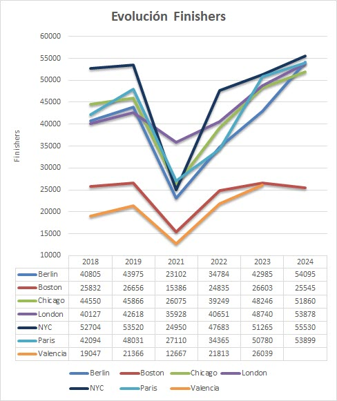
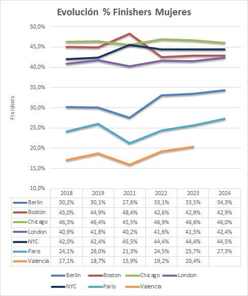

Evolución de finishers 2018-24
============
El próximo domingo se celebra el 44º [maratón de Valencia ](https://www.valenciaciudaddelrunning.com/maraton/maraton/), una edición muy especial por el desafortunado desastre que produjo la DANA el pasado 29 de octubre.

El maratón de Valencia tiene la etiqueta platino de la World Athletics y es el mejor maratón de España según la Real Federación Española de Atletismo (RFEA). Los récords actuales son de Sisay Lemma 2:01:48, el año pasado, siendo la sexta mejor marca de la historia y de Amane Beriso 2:14:58, en 2022, quinta mejor marca de la historia.

Los maratones más prestigiosos del mundo han visto cambios significativos en la participación a lo largo de los últimos años. Factores como la pandemia de COVID-19, la evolución de las ciudades como destinos deportivos y el creciente interés por el running han marcado esta transformación. En este artículo, analizamos cómo ha cambiado el número de corredores que cruzan la meta en siete de los maratones más importantes del mundo: Berlín, Boston, Chicago, Londres, Nueva York, París y Valencia, utilizando datos desde 2018 hasta 2024.

## Tendencias principales (2018-2024)

### Impacto de la pandemia (2021)
Los datos muestran una fuerte caída en el número de finishers en 2021, reflejando las restricciones globales debido al COVID-19. Por ejemplo, en Berlín, el número de corredores se redujo a 23102, casi la mitad de los participantes en 2019. Este patrón se repite en todas las ciudades.

### Recuperación post-pandemia (2022-2023)
La recuperación comenzó en 2022, con un aumento significativo en el número de finishers. En Londres, los participantes crecieron de 35928 en 2021 a 40651 en 2022, alcanzando 48740 en 2023, superando incluso los niveles prepandemia.

### Récords recientes (2024):
En 2024, ciudades como Berlín y Nueva York registraron máximos históricos de participación, con 54095 y 55530 finishers respectivamente. Estos números destacan el resurgimiento del interés en eventos masivos tras los desafíos de los últimos años.

### Análisis por ciudades

* __Berlín__ : Líder en crecimiento continuo. En 2024, alcanzó 54,095 finishers, consolidándose como uno de los destinos favoritos para los corredores que buscan superar marcas personales, gracias a su recorrido rápido y bien organizado.
* __Boston__: Aunque muestra cierta estabilidad, el crecimiento ha sido más moderado comparado con otras ciudades.
* __Chicago y Londres__: Ambas han experimentado un crecimiento sólido desde la pandemia, con cifras en 2024 que superan ampliamente las de 2019.
* __Nueva York__: Ha batido este año el récord absoluto de participación con 55530 corredores.
* __Valencia__: Aunque el evento es más pequeño en comparación con otros, sigue ganando popularidad como uno de los maratones más rápidos del mundo. Su número de finishers en 2023 fue notable, superando los 26,000. ¿Superará en esta edición su récord?

Estos son los datos:

| City      | 2018   | 2019   | 2021   | 2022   | 2023   | 2024   |
|-----------|--------|--------|--------|--------|--------|--------|
| Berlin    | 40805  | 43975  | 23102  | 34784  | 42985  | 54095  |
| Boston    | 25832  | 26656  | 15386  | 24835  | 26603  | 25545  |
| Chicago   | 44550  | 45866  | 26075  | 39249  | 48246  | 51860  |
| London    | 40127  | 42618  | 35928  | 40651  | 48740  | 53878  |
| NYC       | 52704  | 53520  | 24950  | 47683  | 51265  | 55530  |
| Paris     | 42094  | 48031  | 27110  | 34365  | 50780  | 53899  |
| Valencia  | 19047  | 21366  | 12667  | 21813  | 26039  |        |
| **Total** | **265159** | **282032** | **165218** | **243380** | **294658** | **294807** |

  

## La participación femenina en los maratones (2018-2024)
La inclusión y representación femenina en los maratones ha mostrado un crecimiento constante en los últimos años, aunque con diferencias significativas entre ciudades. En esta sección, analizamos cómo ha evolucionado el porcentaje de mujeres finishers en los grandes maratones del mundo desde 2018 hasta 2024.

### Tendencias generales (2018-2024)
El porcentaje de participación femenina ha aumentado globalmente en este periodo, pasando del 36,4% en 2018 al 39,2% en 2024. Este incremento refleja un avance en la igualdad de género en el running, aunque aún persisten diferencias entre ciudades.

### 2021, un año atípico
La pandemia no solo afectó el número total de finishers, sino que también alteró la proporción de mujeres participantes. En muchas ciudades, como Berlín (27,6%) y París (21,3%), la participación femenina cayó notablemente, posiblemente debido a factores como restricciones de viaje y prioridades cambiantes.

### Recuperación y crecimiento sostenido
Desde 2022, el porcentaje de mujeres ha comenzado a estabilizarse y crecer nuevamente. En 2024, la proporción total alcanzó un máximo histórico del 39,2%, mostrando una tendencia alentadora hacia una mayor equidad en la participación.

### Análisis por ciudades

* __Chicago, Boston y Nueva York__: Líderes en inclusión femenina. Estas ciudades han mantenido consistentemente altos niveles de participación femenina, Chicago alcanzó su punto máximo en 2022 con un 46,9% y se mantiene alrededor del 46%. Boston y Nueva York destacan con cifras superiores al 42%, evidenciando una sólida representación de mujeres.
* __Berlín y Londres__: Aunque históricamente han tenido una menor representación femenina, ambas ciudades han mostrado un progreso constante. Berlín pasó del 30,2% en 2018 al 34,3% en 2024. Londres se encuentra por encima del 40%, con un pico del 42,4% en 2024.
* __París y Valencia__: Estas ciudades, con menor representación femenina en comparación con otras, han mostrado un crecimiento notable. París incrementó su participación femenina del 24,1% en 2018 al 27,3% en 2024. Valencia, aunque con cifras más bajas, muestra una tendencia al alza, alcanzando el 20,4% en 2023, ¿Superará en 2024 esta marca?
  
Estos son los datos:

| City     | 2018   | 2019   | 2021   | 2022   | 2023   | 2024   |
|----------|--------|--------|--------|--------|--------|--------|
| Berlin   | 30,2%  | 30,1%  | 27,6%  | 33,1%  | 33,5%  | 34,3%  |
| Boston   | 45,0%  | 44,9%  | 48,4%  | 42,6%  | 42,9%  | 42,9%  |
| Chicago  | 46,3%  | 46,4%  | 45,5%  | 46,9%  | 46,6%  | 46,0%  |
| London   | 40,9%  | 41,8%  | 40,2%  | 41,6%  | 41,5%  | 42,4%  |
| NYC      | 42,0%  | 42,4%  | 45,5%  | 44,4%  | 44,4%  | 44,5%  |
| Paris    | 24,1%  | 26,0%  | 21,3%  | 24,5%  | 25,7%  | 27,3%  |
| Valencia | 17,1%  | 18,7%  | 15,9%  | 19,2%  | 20,4%  |        |
| **Total**| **36,4%** | **36,7%** | **35,9%** | **37,4%** | **37,2%** | **39,2%** |

  

