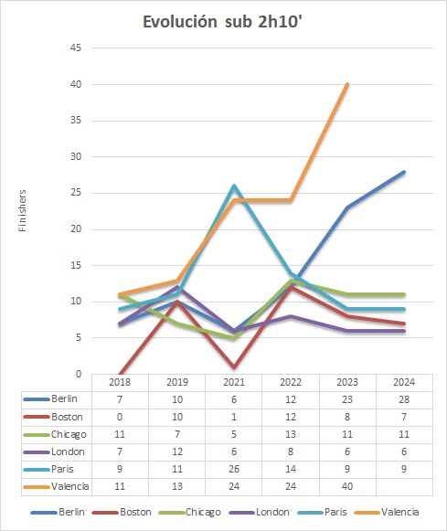
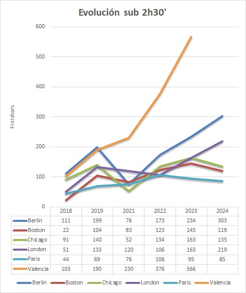
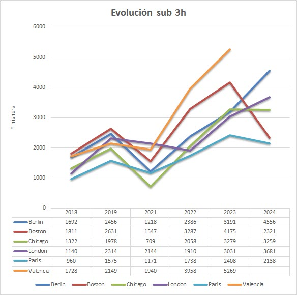
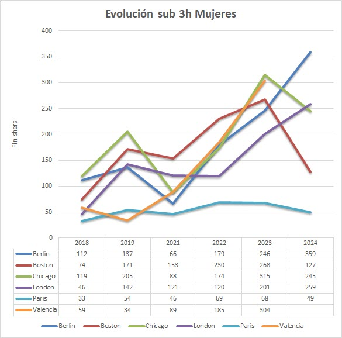

Evolución del rendimiento 2018-24
============

Los maratones no solo son eventos masivos de participación, sino también escenarios de élite donde los mejores corredores del mundo compiten para superar límites. Un indicador clave del nivel competitivo de una carrera es el número de atletas que logran terminar en menos de unos tiempos determinados. Este análisis detalla cómo ha evolucionado este aspecto en seis de los principales maratones desde 2018 hasta 2024.

## Atletas sub 2h10'

El número de atletas sub 2h10' ha mostrado un crecimiento significativo en los últimos años, especialmente en ciudades como Berlín y Valencia. Desde 2021, el rendimiento de élite parece haber regresado con fuerza tras las interrupciones causadas por la pandemia.

* __2023-2024, un boom de marcas rápidas:__ Berlín pasó de 7 atletas sub 2h10' en 2018 a 28 en 2024, evidenciando su consolidación como el recorrido más rápido del mundo. Valencia marcó un hito espectacular en 2023 con 40 atletas sub 2h10', posicionándose como una de las pruebas favoritas para buscar marcas rápidas.
* __Estabilidad en otras ciudades:__ Londres y París, a pesar de su prestigio, han mostrado cifras más moderadas. En 2024, Londres registró solo 6 corredores sub 2h10', en comparación con los 14 de París en 2022. Boston destaca por su baja cantidad, con una media inferior a 10 atletas por año, en parte debido a la dificultad de su recorrido.
* __El efecto de la pandemia (2021):__ En 2021, tras la reanudación de los eventos, el número de atletas sub 2h10' fue bajo en casi todas las ciudades. París y Valencia fueron las excepciones, con 26 y 24 corredores respectivamente.

### Análisis por ciudades

* __Berlín, el epicentro de los récords mundiales:__ Berlín, conocida por su recorrido plano y rápido, continúa atrayendo a los mejores maratonistas. Su crecimiento de 7 corredores sub 2h10' en 2018 a 28 en 2024 es testimonio de su evolución como un destino para romper marcas personales y mundiales.
* __Valencia, el ascenso meteórico:__ Valencia se ha convertido en el favorito de la élite mundial. En 2023, duplicó el número de corredores sub 2h10' de París y Berlín, consolidándose como uno de los maratones más rápidos del mundo.
* __Chicago y Londres, constancia en las cifras:__ Chicago ha mantenido un promedio de 10-13 corredores sub 2h10' por año, destacando en 2022 con 13 atletas. Londres, aunque icónico, parece haber perdido terreno frente a competidores como Valencia y Berlín.

Estos son los datos:

| City     | 2018 | 2019 | 2021 | 2022 | 2023 | 2024 |
|----------|------|------|------|------|------|------|
| Berlin   | 7    | 10   | 6    | 12   | 23   | 28   |
| Boston   | 0    | 10   | 1    | 12   | 8    | 7    |
| Chicago  | 11   | 7    | 5    | 13   | 11   | 11   |
| London   | 7    | 12   | 6    | 8    | 6    | 6    |
| Paris    | 9    | 11   | 26   | 14   | 9    | 9    |
| Valencia | 11   | 13   | 24   | 24   | 40   |      |

 

## Atletas sub 2h30'

El rendimiento de los corredores sub 2h30 ha mostrado un crecimiento significativo en varias ciudades desde 2018, con un auge particular en recorridos rápidos como Berlín y Valencia. Aunque 2021 marcó una caída general debido a la pandemia, los números han vuelto a crecer rápidamente en los años posteriores.

* __Valencia, líder absoluto en sub 2h30:__ En 2018, Valencia contaba con 103 corredores sub 2h30. En 2023, esta cifra se disparó a 566, más que cualquier otro maratón del mundo. Este crecimiento demuestra la calidad del evento, el enfoque en atraer a atletas élite y su recorrido optimizado para marcas rápidas.
* __Berlín, progresión constante:__ Con 111 finishers sub 2h30 en 2018, Berlín alcanzó 303 corredores en 2024, consolidándose como el maratón más popular entre la élite global. 
* __Boston y Londres, una élite estable:__ Boston, conocido por su recorrido ondulado, ha oscilado entre los 22 corredores de 2018 y los 145 en 2023, un año especialmente competitivo. Londres, aunque menos consistente, alcanzó un pico importante en 2024 con 219 corredores sub 2h30, casi duplicando los números de 2018.
* __Chicago y París, resultados variables:__ Chicago registró números notables, alcanzando su máximo de 163 corredores en 2023. París, aunque menos destacada que las demás, también tuvo un crecimiento, pasando de 44 corredores en 2018 a un máximo de 106 en 2022.
* __Impacto de la pandemia (2021):__ En 2021, tras la reanudación de los eventos, el número de finishers sub 2h30 cayó significativamente en casi todas las ciudades. Sin embargo, Valencia mostró una excepción destacada, con un aumento hasta 230 corredores, consolidando su reputación.

### Análisis por ciudades

* __Valencia, la revolución del rendimiento:__ El crecimiento de Valencia es asombroso. De ser una carrera destacada pero no líder en 2018, se convirtió en el maratón con más corredores sub 2h30 del mundo en 2023, superando incluso a Berlín.
* __Berlín, dominio consolidado:__ Berlín sigue demostrando que es el escenario ideal para los corredores que buscan marcas rápidas. Su combinación de recorrido plano, organización impecable y el peso de los récords mundiales lo hace irresistible.
* __Boston y Londres, prestigio frente a la rapidez:__ Aunque ambos maratones son eventos icónicos, su recorrido no siempre favorece las marcas rápidas. Aun así, sus números de sub 2h30 son consistentes y demuestran la alta calidad de los participantes.
* __París y Chicago, protagonistas secundarios:__ París y Chicago ofrecen buenos resultados, aunque todavía están por debajo del nivel de Berlín o Valencia en cuanto a cantidad de corredores sub 2h30.

Estos son los datos:

| City     | 2018 | 2019 | 2021 | 2022 | 2023 | 2024 |
|----------|------|------|------|------|------|------|
| Berlin   | 111  | 199  | 76   | 173  | 234  | 303  |
| Boston   | 22   | 104  | 83   | 123  | 145  | 119  |
| Chicago  | 91   | 140  | 52   | 134  | 163  | 135  |
| London   | 51   | 133  | 120  | 106  | 163  | 219  |
| Paris    | 44   | 69   | 76   | 106  | 95   | 85   |
| Valencia | 103  | 190  | 230  | 376  | 566  |      |

 

## Atletas sub 3h

El número de corredores que logran completar un maratón en menos de 3 horas es un indicador clave del nivel competitivo general, no solo para los atletas élite, sino también para corredores aficionados avanzados. Este análisis explora cómo ha evolucionado este grupo en seis de los maratones más prestigiosos del mundo entre 2018 y 2024.

Los datos reflejan un crecimiento significativo del número de finishers sub 3h en la mayoría de los maratones estudiados, impulsado por la mejora en las condiciones de las carreras, avances en el equipamiento deportivo (como zapatillas de alto rendimiento) y una mayor preparación de los corredores.

* __Valencia, un auge imparable:__  En 2018, Valencia ya era un referente con 1728 corredores sub 3h. Sin embargo, en 2023, esta cifra alcanzó un impresionante 5269 finishers, convirtiéndose en el líder indiscutible de este grupo competitivo. Este crecimiento destaca por la excelente organización de la carrera, el perfil plano del recorrido y la promoción activa del evento como uno de los más rápidos del mundo.
* __Berlín, un incremento constante:__ Berlín, conocido por sus marcas rápidas, ha experimentado un crecimiento sostenido desde los 1692 finishers en 2018 hasta alcanzar 4556 en 2024. La combinación de un recorrido plano y condiciones climáticas ideales lo posiciona como uno de los destinos favoritos de los corredores sub 3h.
* __Boston, un perfil desafiante pero consistente:__ Aunque su recorrido ondulado puede dificultar la obtención de marcas rápidas, Boston sigue atrayendo a corredores sub 3h. Con un máximo de 4175 finishers en 2023, demuestra la alta calidad competitiva de sus participantes.
* __Londres, incremento notable en los últimos años:__ Londres ha visto un crecimiento constante en este grupo, pasando de 1140 finishers en 2018 a 3681 en 2024. Su estatus como uno de los World Marathon Majors más prestigiosos atrae a corredores experimentados.
* __Chicago, fluctuaciones moderadas:__ Chicago ha mostrado variaciones, alcanzando su máximo de 3279 finishers sub 3h en 2023, pero manteniéndose en torno a las 3200 marcas en los últimos años.
* __París, crecimiento modesto:__ Aunque no tan destacado como otras carreras, París ha aumentado de 960 corredores sub 3h en 2018 a 2408 en 2023, reflejando su popularidad creciente.

### Impacto de la pandemia (2021)
El año 2021 mostró una caída significativa en el número de finishers sub 3h en todas las ciudades debido a las restricciones y limitaciones en los eventos masivos. Sin embargo, Valencia logró mantener cifras relativamente altas, con 1940 finishers, destacándose nuevamente como un destino preferido incluso en tiempos adversos.

### Análisis por ciudades

* __Valencia, el nuevo líder global:__ Valencia no solo lidera en términos de corredores sub 2h30, sino también en el grupo sub 3h. Su recorrido plano, excelente organización y clima favorable han atraído a un número creciente de corredores que buscan superar esta barrera.
* __Berlín, consistencia y prestigio:__ Berlín continúa consolidándose como uno de los destinos más populares para los corredores que buscan marcas rápidas, gracias a su enfoque en la excelencia organizativa y su reputación como escenario de récords mundiales.
* __Boston y Londres, tradición y excelencia:__ Ambos maratones se caracterizan por su prestigio y tradición, atrayendo a corredores de todo el mundo que buscan retos tanto en velocidad como en historia.
* __Chicago y París, retadores secundarios:__ Aunque sus números son más modestos, Chicago y París mantienen un crecimiento constante, atrayendo a corredores que buscan rutas rápidas y bien organizadas.

Estos son los datos:

| City     | 2018  | 2019  | 2021  | 2022  | 2023  | 2024  |
|----------|-------|-------|-------|-------|-------|-------|
| Berlin   | 1692  | 2456  | 1218  | 2386  | 3191  | 4556  |
| Boston   | 1811  | 2631  | 1547  | 3287  | 4175  | 2321  |
| Chicago  | 1322  | 1978  | 709   | 2058  | 3279  | 3259  |
| London   | 1140  | 2314  | 2144  | 1910  | 3031  | 3681  |
| Paris    | 960   | 1575  | 1171  | 1738  | 2408  | 2138  |
| Valencia | 1728  | 2149  | 1940  | 3958  | 5269  |       |

 

## Mujeres sub 3h

El número de mujeres que logran completar un maratón en menos de 3 horas es un indicador clave de la evolución del nivel competitivo en el atletismo femenino. Entre los principales maratones del mundo, se observa un crecimiento notable en este grupo, reflejando tanto avances en la preparación de las corredoras como el impacto de las políticas de inclusión y el acceso a recursos para el deporte femenino.

El número de mujeres sub 3h ha aumentado significativamente en los últimos años en la mayoría de los maratones, con un salto particularmente notable en Berlín y Valencia, que destacan como destinos preferidos para corredoras rápidas.

El crecimiento general refleja la mejora en las condiciones de las carreras, el acceso a tecnología deportiva y el fortalecimiento de las categorías femeninas en competiciones.

En 2021, las restricciones relacionadas con la pandemia afectaron las cifras en muchos maratones, pero algunos, como Berlín y Chicago, mantuvieron números relativamente estables para las mujeres sub 3h.

### Análisis por ciudades

* __Berlín, dominio femenino:__ Berlín lidera consistentemente el grupo de mujeres sub 3h, con un aumento desde 112 finishers en 2018 a un impresionante 359 en 2024. Este crecimiento se atribuye al recorrido plano, las condiciones ideales y su fama como una de las carreras más rápidas del mundo.
* __Valencia, un crecimiento explosivo:__ Valencia pasó de 59 finishers en 2018 a un máximo de 304 en 2023, consolidándose como uno de los destinos preferidos para mujeres élite y amateurs avanzadas. El salto en 2022 y 2023 resalta el atractivo creciente de Valencia como uno de los maratones más competitivos del mundo.
* __Boston, tradición y alta competitividad:__ Boston mantiene cifras sólidas, con un máximo de 268 mujeres sub 3h en 2023. A pesar de la dureza de su recorrido, la carrera sigue atrayendo a las mejores corredoras.
* __Chicago y Londres, fluctuaciones moderadas:__ Chicago y Londres muestran una evolución interesante. Chicago pasó de 119 mujeres sub 3h en 2018 a 245 en 2024, consolidándose como una cita clave para corredoras competitivas.
* __Londres:__ Con un aumento de 46 finishers en 2018 a 259 en 2024, refleja un crecimiento sostenido en su atractivo para el atletismo femenino.
* __París, incremento modesto:__ París mantiene un crecimiento moderado, con cifras fluctuando desde 33 mujeres en 2018 hasta un máximo de 69 en 2022. Aunque su evolución es más modesta, sigue siendo un destino competitivo.

Estos son los datos:

| City     | 2018 | 2019 | 2021 | 2022 | 2023 | 2024 |
|----------|------|------|------|------|------|------|
| Berlin   | 112  | 137  | 66   | 179  | 246  | 359  |
| Boston   | 74   | 171  | 153  | 230  | 268  | 127  |
| Chicago  | 119  | 205  | 88   | 174  | 315  | 245  |
| London   | 46   | 142  | 121  | 120  | 201  | 259  |
| Paris    | 33   | 54   | 46   | 69   | 68   | 49   |
| Valencia | 59   | 34   | 89   | 185  | 304  |      |

 

