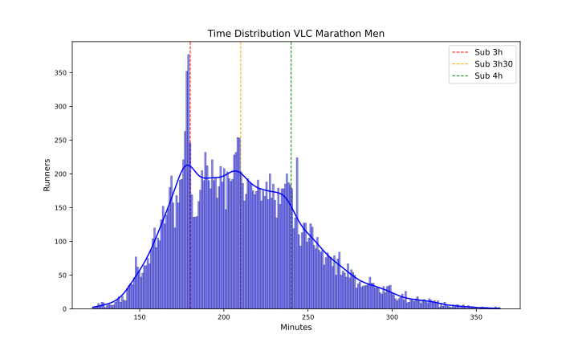
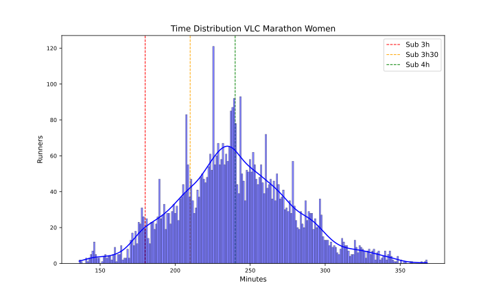

VLC 2024
========

# Datos del maratón de VLC 2024 Fecha: 01/12/24

El maratón de VLC 2024 ha tenido 28183 finishers, de los que 6119 fueron mujeres, lo que supone un 21.71% del total.

El tiempo medio de todos los participantes ha sido 3:39:12, el de los hombres 3:33:30 y el de las mujeres 4:00:00.

El tiempo medio del 10% más rápido ha sido 2:38:54, y el del 25% 2:51:24.El tiempo medio de los 100 primeros ha sido 2:11:48, y para los 1000 primeros 2:28:30.

En esta tabla se resume el número de finishers por espacios de tiempos y el porcentaje respecto al total:  

|Tiempo|Finishers|%|
| :---: | :---: | :---: |
|Sub2:10|31|0.11|
|Sub2:20|135|0.48|
|Sub2:30|512|1.82|
|Sub2:45|1916|6.8|
|Sub3:00|5201|18.45|
|Sub3:30|12640|44.85|
|Sub4:00|20164|71.55|
|Over4:00|8019|28.45|

Por último, en cuanto al resumen general, la primera media maratón tiene un tiempo medio de 1:43:36 y la segunda de 1:55:42 con un 12.0% de Negative Pace. Para los hombres, la primera media maratón tiene un tiempo medio de 1:40:36 y la segunda de 1:52:54 con un 11.82% de Negative Pace. Y para las mujeres, la primera media maratón tiene un tiempo medio de 1:54:12 y la segunda de 2:05:54 con un 12.67% de Negative Pace.

Las siguientes imágenes muestran la distribución de tiempos de los corredores en el maratón por género:  
  
  

## Datos por grupo de edad y género

A continuación se muestran los datos de los corredores por grupos de edad y género:
### Resultados por grupos de edad en hombres
  

| AgeGroup   |     % | Mean    | Min     | Max     |
|:-----------|------:|:--------|:--------|:--------|
| 23-34      | 25.83 | 3:25:00 | 2:02:06 | 5:27:42 |
| 40-44      | 17.25 | 3:28:24 | 2:04:36 | 5:28:36 |
| 45-49      | 16.57 | 3:35:24 | 2:16:24 | 5:29:06 |
| 35-39      | 15.79 | 3:24:18 | 2:05:48 | 5:25:48 |
| 50-54      | 12.72 | 3:44:00 | 2:25:00 | 5:29:48 |
| 55-59      |  6.55 | 3:51:54 | 2:34:12 | 5:27:12 |
| 60-64      |  3.05 | 4:07:00 | 2:47:06 | 5:29:42 |
| 65-69      |  0.93 | 4:10:30 | 2:57:36 | 5:27:30 |
| 20-22      |  0.9  | 3:45:30 | 2:04:42 | 5:27:36 |
| 70-74      |  0.2  | 4:28:48 | 3:36:24 | 5:24:12 |
| 18-19      |  0.12 | 3:57:00 | 2:44:30 | 5:17:12 |
| 75-79      |  0.06 | 4:35:24 | 3:50:30 | 5:01:18 |  

### Resultados por grupos de edad en mujeres
  

| AgeGroup   |     % | Mean    | Min     | Max     |
|:-----------|------:|:--------|:--------|:--------|
| 23-34      | 33.65 | 3:53:12 | 2:16:48 | 5:27:48 |
| 40-44      | 17.5  | 3:58:06 | 2:23:42 | 5:28:06 |
| 45-49      | 14.94 | 4:03:00 | 2:29:30 | 5:27:12 |
| 35-39      | 14.23 | 3:52:36 | 2:21:42 | 5:24:00 |
| 50-54      | 10.93 | 4:12:00 | 2:46:00 | 5:29:24 |
| 55-59      |  4.94 | 4:20:12 | 2:51:36 | 5:24:12 |
| 60-64      |  1.99 | 4:28:18 | 2:42:36 | 5:28:30 |
| 20-22      |  1.14 | 4:14:00 | 2:18:36 | 5:27:36 |
| 65-69      |  0.41 | 4:27:30 | 3:39:12 | 5:22:36 |
| 70-74      |  0.16 | 4:31:36 | 3:42:42 | 5:02:12 |
| 18-19      |  0.1  | 4:39:54 | 3:21:24 | 5:17:12 |  

## Datos por tramos de 5 kms

A continuación se muestran los datos de los corredores por tramos de 5 kms: 5K, 10K, 15K, 20K, 25K, 30K, 35K y 40K.

El porcentaje de errores de chip por cada punto de control es:  

|Punto|%|
| :---: | :---: |
|05K|1.3|
|10K|0.81|
|15K|0.93|
|20K|0.97|
|HALF|0.98|
|25K|1.4|
|30K|1.31|
|35K|1.53|
|40K|1.14|

Eliminamos los corredores con errores en algún punto de control.

El tramo de 5K más rápido ha sido: 14:06 del atleta SAWE, SEBASTIAN en el punto 40Km.

En la siguiente tabla se muestran los tiempos medios y más rápidos de los hombres por tramos de 5 kms:

| Point   | Mean    | Min     |
|:--------|:--------|:--------|
| 05Km    | 0:24:12 | 0:14:30 |
| 10Km    | 0:23:54 | 0:14:30 |
| 15Km    | 0:24:00 | 0:14:36 |
| 20Km    | 0:24:06 | 0:14:30 |
| 25Km    | 0:24:42 | 0:14:36 |
| 30Km    | 0:25:36 | 0:14:30 |
| 35Km    | 0:27:12 | 0:14:24 |
| 40Km    | 0:27:54 | 0:14:06 |

El tramo de 5K más rápido ha sido: 15:48 de la atleta ALEMU, MEGERTU en el punto 20Km.

En la siguiente tabla se muestran los tiempos medios y más rápidos de las mujeres por tramos de 5 kms:

| Point   | Mean    | Min     |
|:--------|:--------|:--------|
| 05Km    | 0:27:12 | 0:16:06 |
| 10Km    | 0:27:06 | 0:15:54 |
| 15Km    | 0:27:18 | 0:15:54 |
| 20Km    | 0:27:36 | 0:15:48 |
| 25Km    | 0:28:18 | 0:16:00 |
| 30Km    | 0:29:12 | 0:16:12 |
| 35Km    | 0:30:24 | 0:16:48 |
| 40Km    | 0:30:24 | 0:16:36 |

Para terminar con el estudio de los tramos de 5 kms, en las siguientes tablas se muestra el porcentaje de corredores que han hecho el tramo más rápido y más lento:

| PointMin   |     % |
|:-----------|------:|
| 10Km       | 28.7  |
| 05Km       | 20.45 |
| 20Km       | 20.14 |
| 15Km       | 16.61 |
| 40Km       |  7.42 |
| 30Km       |  3.12 |
| 25Km       |  2.82 |
| 35Km       |  0.75 |  

| PointMax   |     % |
|:-----------|------:|
| 40Km       | 52.99 |
| 35Km       | 28.91 |
| 05Km       | 10.13 |
| 30Km       |  3.43 |
| 25Km       |  2.12 |
| 10Km       |  0.99 |
| 20Km       |  0.78 |
| 15Km       |  0.66 |