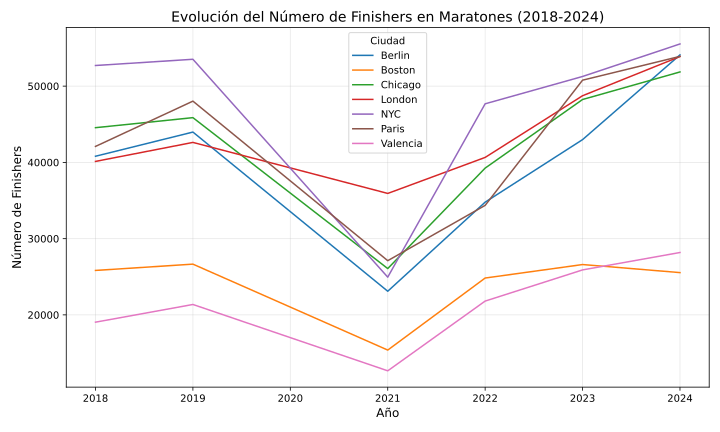
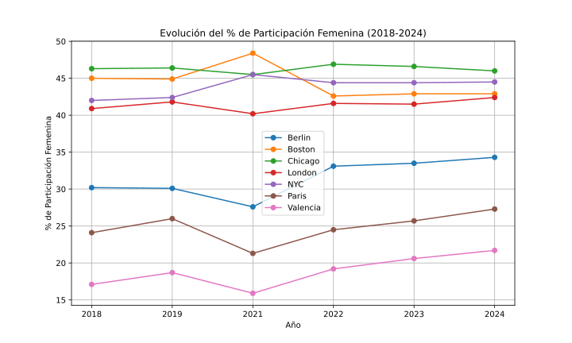

Evolución de finishers 2018-24
============
**Análisis del Número de Finishers en Maratones**

En los últimos años, el número de corredores que finalizan maratones ha crecido significativamente, alcanzando cifras récord en 2024. Tras la celebración, el pasado domingo, del maratón de Valencia, actualizamos y analizamos todos los datos.

---

#### Evolución del Número de Finishers por Ciudad

A continuación, se presenta una tabla con los datos de finishers de maratones entre 2018 y 2024:

| City      | 2018   | 2019   | 2021   | 2022   | 2023   | 2024   |
|-----------|--------|--------|--------|--------|--------|--------|
| Berlin    | 40,805 | 43,975 | 23,102 | 34,784 | 42,985 | 54,095 |
| Boston    | 25,832 | 26,656 | 15,386 | 24,835 | 26,603 | 25,545 |
| Chicago   | 44,550 | 45,866 | 26,075 | 39,249 | 48,246 | 51,860 |
| London    | 40,127 | 42,618 | 35,928 | 40,651 | 48,740 | 53,878 |
| NYC       | 52,704 | 53,520 | 24,950 | 47,683 | 51,265 | 55,530 |
| Paris     | 42,094 | 48,031 | 27,110 | 34,365 | 50,780 | 53,899 |
| Valencia  | 19,047 | 21,366 | 12,667 | 21,813 | 25,900 | 28,183 |
| **Total** | **265,159** | **282,032** | **165,218** | **243,380** | **294,519** | **322,990** |

---

### Análisis de los Resultados de 2024

El año 2024 ha sido excepcional para los maratones más importantes del mundo. El número total de finishers alcanzó **322,990**, marcando un crecimiento significativo del **9,7%** respecto a 2023, pero si lo miramos desde 2018 el crecimiento es de un notable **21,8%**.

- **Nueva York** sigue liderando en participación, con **55,530 finishers**. Este dato refuerza su posición como el maratón más popular del mundo.
- **Berlín** y **Londres** experimentaron aumentos significativos en el número de corredores, con incrementos del **25,4%** y **10,5%**, respectivamente.
- En contraste, **Boston** mostró una ligera disminución en comparación con 2023, debido a los cambios en los criterios de clasificación.

---

El maratón de **Valencia** destaca como uno de los eventos con mayor crecimiento en los últimos años. En **2024**, alcanzó los **28,183 finishers**, consolidándose como una de las pruebas más atractivas para los corredores de todo el mundo. Comparado con 2018, el número de finishers ha aumentado un **48%**, lo que refleja:

1. **Organización de primer nivel:** Valencia ha sido reconocida por su circuito rápido y su ambiente acogedor.
2. **Condiciones ideales:** El clima y el terreno plano de la ciudad lo convierten en un destino favorito para los corredores que buscan superar sus marcas personales.
3. **Atractivo internacional:** Cada año, más corredores extranjeros participan en este evento.

---

### Gráfica de Tendencias

A continuación, se presenta una gráfica que ilustra la evolución del número de finishers entre 2018 y 2024:

 

---
## Análisis de la Participación Femenina

En esta tabla podemos ver el porcentaje de participación femenina en los principales maratones del mundo desde 2018 hasta 2024:

### Tabla de Participación Femenina

| City     | 2018  | 2019  | 2021  | 2022  | 2023  | 2024  |
|----------|-------|-------|-------|-------|-------|-------|
| Berlin   | 30.2% | 30.1% | 27.6% | 33.1% | 33.5% | **34.3%** |
| Boston   | 45.0% | 44.9% | 48.4% | 42.6% | 42.9% | **42.9%** |
| Chicago  | 46.3% | 46.4% | 45.5% | 46.9% | 46.6% | **46.0%** |
| London   | 40.9% | 41.8% | 40.2% | 41.6% | 41.5% | **42.4%** |
| NYC      | 42.0% | 42.4% | 45.5% | 44.4% | 44.4% | **44.5%** |
| Paris    | 24.1% | 26.0% | 21.3% | 24.5% | 25.7% | **27.3%** |
| Valencia | 17.1% | 18.7% | 15.9% | 19.2% | 20.6% | **21.7%** |
| **Total** | **36.4%** | **36.7%** | **35.9%** | **37.4%** | **37.2%** | **37.7%** |

### Análisis del Año 2024

En 2024, **la participación femenina total alcanzó el 37.7%**, marcando un leve aumento respecto a 2023 (37.2%). Este crecimiento, aunque modesto, refleja un progreso continuo en la inclusión de mujeres en las principales competencias de larga distancia. Es de valorar el incremento que se ha producido entre 2018 y 2024 que es un **26,1%**.

- **Chicago**: Con una participación femenina siempre superior al 45%, se consolida como una de las maratones del mundo más inclusivas.  
- **Valencia**: Destaca especialmente por su crecimiento constante en los últimos años, alcanzando un **21.7% en 2024**, lo que lo convierte en un caso especial de análisis por ser el maratón con menor proporción femenina entre los grandes eventos. Sin embargo, su progresión es significativa un 17.1% en 2018 a 21.7% en 2024, lo que supone un **87,8%** de crecimiento, pasando de 3259 a 6119 corredoras, mostrando un esfuerzo sostenido por atraer a más mujeres.

### Gráfica de Participación Femenina

A continuación, presentamos una gráfica que muestra la evolución de la participación femenina en los principales maratones entre 2018 y 2024:

