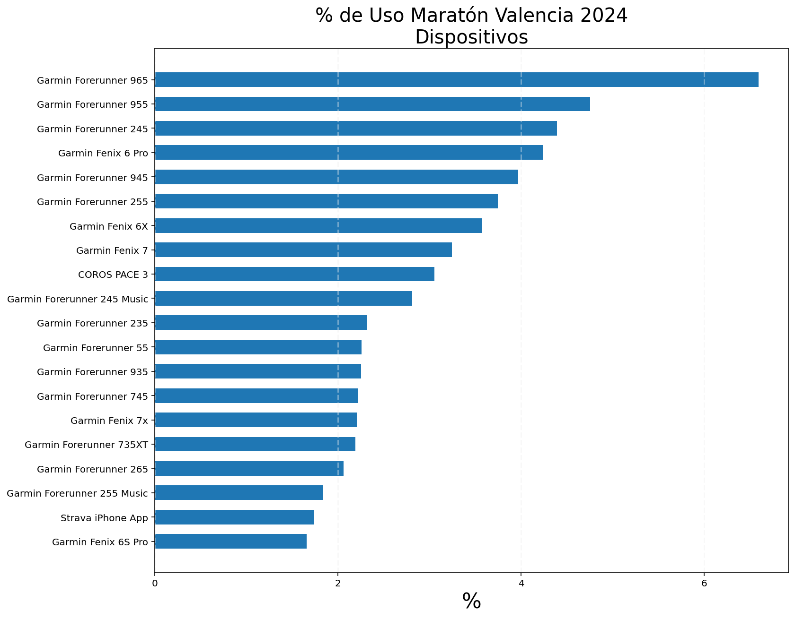
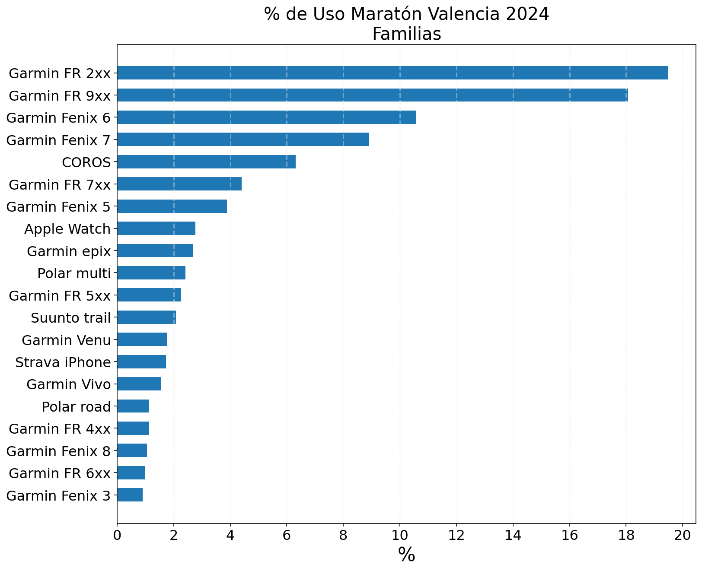
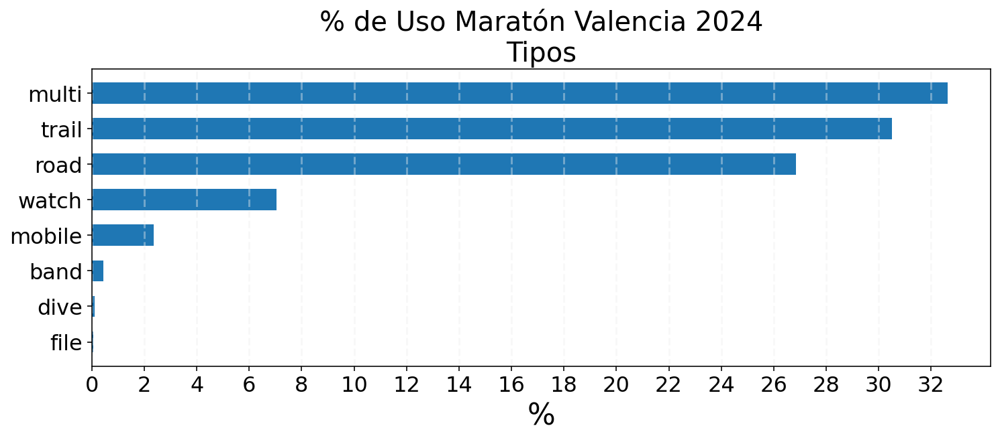
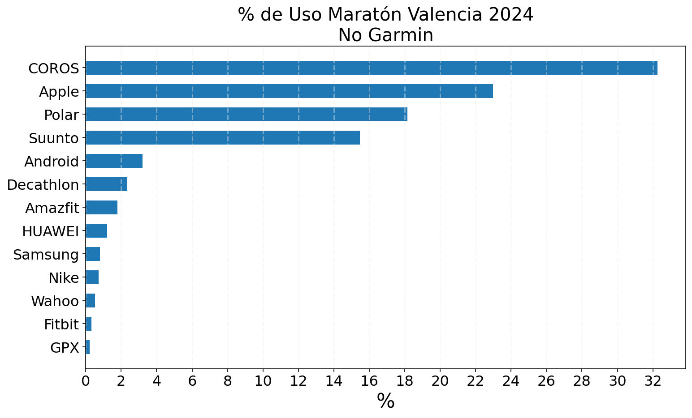

## Introducción

El Maratón de Valencia 2024 nos ha dejado un interesante panorama sobre los dispositivos utilizados por los corredores para medir sus rendimientos. Este análisis se enfoca en los 25 dispositivos más populares, evaluando métricas como el tiempo medio registrado, la distancia calculada y el error medio. También agruparemos los dispositivos por marcas, familias y tipos, y exploraremos qué marcas, aparte de Garmin, han logrado destacar en un sector claramente dominado por esta compañía. 

---

## Dispositivos más utilizados

A continuación, se muestra una tabla con los dispositivos más empleados durante el Maratón de Valencia 2024:

| Pos | Dispositivo                  | % Uso  | Tiempo Medio (h:mm:ss) | Distancia (km) | Error (%) |
|-----|------------------------------|--------|-------------------------|----------------|-----------|
| 1   | Garmin Forerunner 965        | 6.59%  | 3:23:36                | 42.67          | 1.12%     |
| 2   | Garmin Forerunner 955        | 4.75%  | 3:22:47                | 42.65          | 1.07%     |
| 3   | Garmin Forerunner 245        | 4.40%  | 3:32:41                | 42.64          | 1.05%     |
| 4   | Garmin Fenix 6 Pro           | 4.24%  | 3:24:38                | 42.61          | 0.97%     |
| 5   | Garmin Forerunner 945        | 3.97%  | 3:21:07                | 42.64          | 1.07%     |
| 6   | Garmin Forerunner 255        | 3.75%  | 3:32:43                | 42.67          | 1.13%     |
| 7   | Garmin Fenix 6X              | 3.58%  | 3:27:43                | 42.59          | 0.94%     |
| 8   | Garmin Fenix 7               | 3.24%  | 3:26:59                | 42.67          | 1.12%     |
| 9   | COROS PACE 3                 | 3.05%  | 3:15:20                | 42.57          | 0.90%     |
| 10  | Garmin Forerunner 245 Music  | 2.81%  | 3:29:58                | 42.63          | 1.03%     |
| 11  | Garmin Forerunner 235        | 2.32%  | 3:36:13                | 42.51          | 0.76%     |
| 12  | Garmin Forerunner 55         | 2.26%  | 3:46:30                | 42.64          | 1.05%     |
| 13  | Garmin Forerunner 935        | 2.25%  | 3:22:29                | 42.47          | 0.65%     |
| 14  | Garmin Forerunner 745        | 2.22%  | 3:27:13                | 42.61          | 0.98%     |
| 15  | Garmin Fenix 7x              | 2.20%  | 3:26:51                | 42.68          | 1.16%     |
| 16  | Garmin Forerunner 735XT      | 2.19%  | 3:28:49                | 42.50          | 0.73%     |
| 17  | Garmin Forerunner 265        | 2.06%  | 3:33:43                | 42.69          | 1.18%     |
| 18  | Garmin Forerunner 255 Music  | 1.84%  | 3:34:35                | 42.68          | 1.15%     |
| 19  | Strava iPhone App            | 1.74%  | 3:53:56                | 42.80          | 1.43%     |
| 20  | Garmin Fenix 6S Pro          | 1.66%  | 3:37:16                | 42.59          | 0.94%     |
| 21  | Garmin Fenix 5               | 1.65%  | 3:23:26                | 42.82          | 1.47%     |
| 22  | Garmin Epix Gen2             | 1.58%  | 3:30:06                | 42.65          | 1.08%     |
| 23  | Garmin Fenix 7s              | 1.49%  | 3:30:22                | 42.67          | 1.13%     |
| 24  | COROS PACE 2                 | 1.34%  | 3:14:57                | 42.69          | 1.17%     |
| 25  | Garmin Forerunner 45         | 1.07%  | 3:40:21                | 42.65          | 1.07%     |

 

---

### Observaciones iniciales

1. **Predominio de Garmin**: Garmin ocupa 23 de los 25 puestos, confirmando su liderazgo absoluto en el mercado.
2. **Dispositivo no Garmin destacado**: Los usuarios de **COROS PACE 3** son los más rápidos, con un tiempo promedio de 3:15:20. Qué muchos atletas de élite estén patrocinados por esta marca puede ser la causa de este gran rendimiento.
3. **Aplicaciones móviles**: La **Strava iPhone App** representa un enfoque diferente, pero con un error mayor del 1.4%.

## Análisis de dispositivos agrupados por familias

A continuación, presentamos el análisis de las **familias de dispositivos** utilizados en el Maratón de Valencia 2024. Este agrupamiento se realiza en función de características técnicas comunes, como gama, marca y orientación de uso.

---

### Tabla de familias

| Pos | Familia              | % Uso  | Tiempo Medio (h:mm:ss) | Distancia (km) | Error (%) |
|-----|----------------------|--------|-------------------------|----------------|-----------|
| 1   | Garmin FR 2xx        | 19.50% | 3:34:19                | 42.65          | 1.07%     |
| 2   | Garmin FR 9xx        | 18.08% | 3:22:47                | 42.63          | 1.03%     |
| 3   | Garmin Fenix 6       | 10.56% | 3:28:14                | 42.60          | 0.95%     |
| 4   | Garmin Fenix 7       | 8.90%  | 3:28:32                | 42.67          | 1.13%     |
| 5   | COROS                | 6.32%  | 3:14:53                | 42.60          | 0.97%     |
| 6   | Garmin FR 7xx        | 4.41%  | 3:27:59                | 42.56          | 0.86%     |
| 7   | Garmin Fenix 5       | 3.89%  | 3:22:50                | 42.83          | 1.50%     |
| 8   | Apple Watch          | 2.76%  | 3:46:12                | 42.66          | 1.09%     |
| 9   | Garmin epix          | 2.69%  | 3:29:51                | 42.65          | 1.07%     |
| 10  | Polar multi          | 2.42%  | 3:23:53                | 42.82          | 1.47%     |
| 11  | Garmin FR 5xx        | 2.26%  | 3:46:30                | 42.64          | 1.05%     |
| 12  | Suunto trail         | 2.07%  | 3:25:54                | 42.76          | 1.34%     |
| 13  | Garmin Venu          | 1.76%  | 3:54:53                | 42.68          | 1.14%     |
| 14  | Strava iPhone        | 1.74%  | 3:53:56                | 42.80          | 1.43%     |
| 15  | Garmin Vivo          | 1.54%  | 3:49:55                | 42.66          | 1.10%     |
| 16  | Polar road           | 1.14%  | 3:29:28                | 42.83          | 1.50%     |
| 17  | Garmin FR 4xx        | 1.13%  | 3:40:58                | 42.65          | 1.07%     |
| 18  | Garmin Fenix 8       | 1.06%  | 3:25:55                | 42.56          | 0.87%     |
| 19  | Garmin FR 6xx        | 0.99%  | 3:11:20                | 42.77          | 1.36%     |
| 20  | Garmin Fenix 3       | 0.91%  | 3:16:38                | 42.79          | 1.40%     |
| 21  | Garmin FR 1xx        | 0.82%  | 3:45:43                | 42.72          | 1.25%     |
| 22  | Garmin Instinct      | 0.79%  | 3:41:50                | 42.61          | 0.98%     |
| 23  | Garmin Esp           | 0.77%  | 3:30:05                | 42.66          | 1.10%     |
| 24  | Suunto road          | 0.68%  | 3:25:44                | 42.63          | 1.03%     |
| 25  | Strava Android       | 0.63%  | 3:56:23                | 42.73          | 1.28%     |

 

---

### Comentarios

1. **Dominio de Garmin en todas las familias**:
   - Las familias **Garmin FR 2xx** (19.5%) y **Garmin FR 9xx** (18.08%) concentran el mayor porcentaje de uso.
   - La familia **Garmin Fenix** en sus diferentes generaciones (Fenix 6, 7 y 5) también es notable, sumando más del 20% de los dispositivos.

2. **Dispositivos no Garmin destacados**:
   - **COROS** ocupa un destacado 5º lugar (6.32%), ofreciendo el tiempo promedio más rápido (3:14:53) entre todas las familias.
   - **Apple Watch** y **Strava** (tanto para iPhone como Android) representan alternativas más casuales o prácticas, pero con errores más elevados.

3. **Precisión y error**:
   Hay que tener en cuenta que para realizar esta parte del estudio se han eliminado las actividades anómalas.
   - Las familias con una mayor precisión son: **Garmin FR 7xx**, **Garmin Fenix 8** y **Garmin Fenix 6**, los valores de **Garmin Fenix 8** habría que estudiarlos más detenidamente debido a su bajo porcentaje de uso, ya que es un modelo relativamente nuevo.
   - Las familias con una menor precisión son: **Garmin Fenix 5**, **Polar multi** y **Polar road**
4. **Segmentos emergentes**:
   - Marcas como **Polar** y **Suunto** mantienen una presencia notable, destacándose en sus categorías **trail** y **road**, respectivamente.
   - **Garmin Instinct**, orientado al segmento outdoor, mantiene un equilibrio en precisión y uso.

Este análisis evidencia la fuerte presencia de Garmin en casi todas las categorías, pero también destaca la entrada de marcas como COROS, Polar y Suunto que compiten en nichos específicos.

## Análisis por Tipos de Dispositivos

En esta sección, analizamos el uso de dispositivos en el Maratón de Valencia 2024 según su **tipo de uso principal**: multisport, trail, running, reloj, móvil, banda y buceo. Este agrupamiento refleja cómo las necesidades específicas de los corredores influyen en su elección de dispositivo.

---

### Tabla de tipos

| Pos | Tipo      | % Uso  | Tiempo Medio (h:mm:ss) | Distancia (km) | Error (%) |
|-----|-----------|--------|-------------------------|----------------|-----------|
| 1   | Multisport | 32.64% | 3:22:53                | 42.63          | 1.04%     |
| 2   | Trail      | 30.51% | 3:27:20                | 42.66          | 1.11%     |
| 3   | Road       | 26.85% | 3:34:54                | 42.66          | 1.10%     |
| 4   | Reloj      | 7.04%  | 3:48:11                | 42.64          | 1.05%     |
| 5   | Móvil      | 2.36%  | 3:55:42                | 42.76          | 1.35%     |
| 6   | Banda      | 0.43%  | 3:55:57                | 42.68          | 1.15%     |
| 7   | Buceo      | 0.10%  | 3:39:07                | 42.62          | 1.00%     |

 

---

### Comentarios

1. **Predominio de dispositivos multisport**:
   - Los dispositivos **multisport** encabezan la lista con un 32.64% de uso. Son populares entre corredores que también practican otras disciplinas deportivas, gracias a su versatilidad y precisión.

2. **Trail y road, cerca en porcentaje pero con diferencias**:
   - **Trail** representa un 30.51% de los dispositivos, destacando por su resistencia y adaptabilidad en entornos montañosos o difíciles.
   - Los dispositivos orientados a **road running** (26.85%) tienen un uso más específico para rutas urbanas, aunque los tiempos promedio son más elevados que los de trail, probablemente por el perfil del corredor.

3. **Relojes y móviles como opciones secundarias**:
   - Los **relojes inteligentes** ocupan un 7.04%, siendo una opción más casual o para corredores menos enfocados en precisión.
   - Los **móviles** (2.36%) y **bandas** (0.43%) se utilizan principalmente por comodidad o funcionalidad básica. Ambos muestran errores más elevados.

4. **Comparativa de precisión**:
   - Los dispositivos de **multisport** y **trail** son los más precisos con un error promedio de 1.04% y 1.11%, respectivamente.
   - **Móviles** y **bandas**, aunque prácticos, presentan los mayores errores, alrededor del 1.35% y 1.15%.

Este análisis por tipo destaca cómo las características específicas de los dispositivos influyen en la experiencia del corredor y en la precisión de las distancias registradas.

## Análisis de Marcas No Garmin

Los dispositivos Garmin acaparan más del 80% del uso, por ello a continuación, exploramos en detalle las marcas de dispositivos que **no pertenecen a Garmin**, centrándonos en su representación, precisión y tiempos promedios en el Maratón de Valencia 2024. Aunque Garmin domina ampliamente, estas marcas destacan en nichos específicos y ofrecen alternativas interesantes para los corredores.

---

### Tabla de marcas no Garmin

| Pos | Marca       | % Uso  | Tiempo Medio (h:mm:ss) | Distancia (km) | Error (%) |
|-----|-------------|--------|-------------------------|----------------|-----------|
| 1   | COROS       | 32.25% | 3:14:53                | 42.60          | 0.97%     |
| 2   | Apple       | 22.97% | 3:46:53                | 42.67          | 1.12%     |
| 3   | Polar       | 18.15% | 3:25:54                | 42.82          | 1.48%     |
| 4   | Suunto      | 15.48% | 3:26:28                | 42.73          | 1.27%     |
| 5   | Android     | 3.20%  | 3:56:23                | 42.73          | 1.28%     |
| 6   | Decathlon   | 2.36%  | 3:31:15                | 42.66          | 1.11%     |
| 7   | Amazfit     | 1.79%  | 3:43:12                | 42.63          | 1.02%     |
| 8   | HUAWEI      | 1.20%  | 3:49:26                | 42.61          | 0.99%     |
| 9   | Samsung     | 0.81%  | 3:55:47                | 42.73          | 1.27%     |
| 10  | Nike        | 0.74%  | 3:45:37                | 42.64          | 1.06%     |
| 11  | Wahoo       | 0.53%  | 3:15:50                | 42.63          | 1.04%     |
| 12  | Fitbit      | 0.32%  | 4:23:54                | 42.84          | 1.52%     |

 

---

### Comentarios

1. **COROS lidera entre las marcas no Garmin**:
   - Con un 32.25% de representación, COROS se posiciona como la marca más utilizada fuera del ecosistema Garmin. 
   - Destaca su **precisión (error 0.97%)** y su **tiempo promedio de 3:14:53**, el más bajo entre todas las marcas.

2. **Apple y dispositivos casuales**:
   - Apple ocupa el segundo lugar (22.97%) y se posiciona como una opción popular entre corredores ocasionales. 

3. **Polar y Suunto en el segmento premium**:
   - **Polar** y **Suunto** son opciones favoritas para corredores especializados, especialmente en trail y road running.
   - Polar presenta la **mayor distancia promedio (42.82 km)**, aunque con un **error elevado (1.48%)**, mientras que Suunto equilibra precisión y versatilidad.

4. **Dispositivos móviles y casuales**:
   - **Android** y **Samsung**, principalmente utilizados a través de aplicaciones como Strava, presentan los tiempos más altos, lo que sugiere un uso más recreativo.
   - **Decathlon** y **Nike** ofrecen dispositivos económicos y básicos, con una moderada precisión y accesibilidad.

---

Este análisis evidencia que, aunque Garmin domina el panorama, marcas como **COROS**, **Polar** y **Suunto** ofrecen alternativas de alto nivel, mientras que **Apple** y **móviles Android** son opciones más accesibles para corredores casuales.